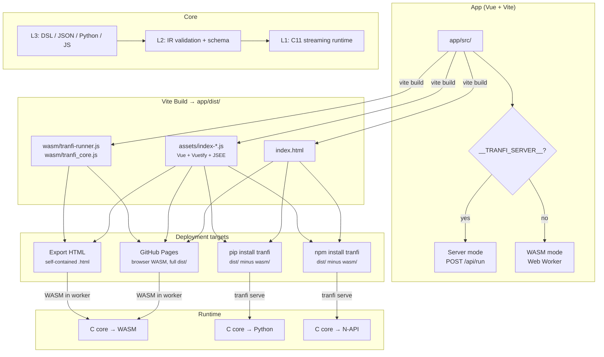

# tranfi

Streaming ETL language in C11. Pipe DSL, push/pull API, columnar batches, 50 built-in operators. Bindings for Python, Node.js, R, and WASM.

```bash
tranfi 'csv | filter "age > 25" | sort -name | derive label=if(col(age)>30,"senior","junior") | csv' < people.csv
```

## Install

**pip** (compiles C core on install):

```bash
pip install tranfi
```

**npm** (compiles native addon, falls back to WASM):

```bash
npm install tranfi
```

**Binary** (prebuilt, no dependencies):

```bash
curl -fsSL https://github.com/tranfi/tranfi/releases/latest/download/tranfi-linux-x64.tar.gz \
  | tar xz && sudo mv tranfi-linux-x64 /usr/local/bin/tranfi
```

## Quick start

### CLI

```bash
# Filter and sort
tranfi 'csv | filter "age > 25" | sort -age | csv' < data.csv

# Built-in recipe
tranfi profile < data.csv

# File I/O
tranfi -i input.csv -o output.csv 'csv | select name,age | csv'

# Compile to JSON plan
tranfi -j 'csv | head 10 | csv'

# List recipes
tranfi -R
```

### Python ([full docs](py/))

```python
import tranfi as tf

# DSL string
result = tf.pipeline('csv | filter "age > 25" | sort -age | csv').run(input_file='data.csv')
print(result.output_text)

# Builder API
result = tf.pipeline([
    tf.codec.csv(),
    tf.ops.filter(tf.expr("col('age') > 25")),
    tf.ops.sort(['-age']),
    tf.codec.csv_encode(),
]).run(input_file='data.csv')
```

### Node.js ([full docs](js/))

```js
import { pipeline, codec, ops, expr } from 'tranfi'

// DSL string
const result = await pipeline('csv | filter "age > 25" | sort -age | csv')
  .run({ inputFile: 'data.csv' })
console.log(result.outputText)

// Builder API
const result2 = await pipeline([
  codec.csv(),
  ops.filter(expr("col('age') > 25")),
  ops.sort(['-age']),
  codec.csvEncode(),
]).run({ inputFile: 'data.csv' })
```

### DuckDB engine

Tranfi pipelines can run on DuckDB instead of the native C core. The DSL is transpiled to SQL in C, so it works across all targets.

```python
# Python
pip install tranfi[duckdb]

result = tf.pipeline('csv | filter "age > 25" | sort -age | csv', engine='duckdb')
  .run(input_file='data.csv')
```

```js
// Node.js
npm install duckdb

const result = await pipeline('csv | filter "age > 25" | sort -age | csv', { engine: 'duckdb' })
  .run({ inputFile: 'data.csv' })
```

```js
// Browser (WASM)
import createTranfi from 'tranfi/wasm'

const tf = await createTranfi()
const result = await tf.runDuckDB(duckdbInstance, 'csv | filter "age > 25" | csv', csvData)
```

The `compileToSql` function is available on all targets for direct SQL generation:

```python
sql = tf.compile_to_sql('csv | filter "age > 25" | sort -age | head 10 | csv')
# WITH
#   step_1 AS (SELECT * FROM input_data WHERE ("age" > 25)),
#   step_2 AS (SELECT * FROM step_1 ORDER BY "age" DESC LIMIT 10)
# SELECT * FROM step_2
```

## Pipe DSL

Pipelines are `source | transform... | sink`. Codecs (`csv`, `jsonl`) auto-resolve by position.

### Codecs

| Codec | Options |
|-------|---------|
| `csv` | `delimiter=;` `header=false` `repair` |
| `jsonl` | |
| `text` | `batch_size=1024` |
| `table` | `max_width=40` `max_rows=0` |

Cross-codec: `csv | ... | jsonl`. The `text` codec splits on newlines into a single `_line` column — no field parsing, no type detection. The `table` codec outputs a Markdown-formatted table (like `csvlook`). Use `csv repair` to auto-fix malformed rows (pad short, truncate long).

### Transforms

| Transform | Syntax | SQL equivalent |
|-----------|--------|---------------|
| `filter` | `filter "col(age) > 25"` | `WHERE age > 25` |
| `select` | `select name,age` | `SELECT name, age` |
| `rename` | `rename name=full_name` | `SELECT name AS full_name` |
| `head` | `head 10` | `LIMIT 10` |
| `tail` | `tail 10` | `ORDER BY rowid DESC LIMIT 10` |
| `skip` | `skip 5` | `OFFSET 5` |
| `derive` | `derive total=col(price)*col(qty)` | `SELECT *, price*qty AS total` |
| `sort` | `sort age` / `sort -age` | `ORDER BY age` / `ORDER BY age DESC` |
| `unique` | `unique name,city` | `SELECT DISTINCT` |
| `stats` | `stats` / `stats count,sum` | `SELECT COUNT(*), SUM(x), AVG(x)...` |
| `validate` | `validate "col(age) > 0"` | `SELECT *, (age > 0) AS _valid` |
| `trim` | `trim name,city` | `SELECT TRIM(name), TRIM(city)` |
| `fill-null` | `fill-null age=0 city=unknown` | `COALESCE(age, 0)` |
| `fill-down` | `fill-down city` | `LAST_VALUE(city IGNORE NULLS) OVER (...)` |
| `cast` | `cast age=int score=float` | `CAST(age AS INT)` |
| `clip` | `clip score 0 100` | `GREATEST(0, LEAST(100, score))` |
| `replace` | `replace name Alice Alicia` | `REPLACE(name, 'Alice', 'Alicia')` |
| `hash` | `hash name,city` | — |
| `bin` | `bin age 18,30,50` | `CASE WHEN age < 18 THEN ... END` |
| `step` | `step price running-sum cumsum` | `SUM(price) OVER (ROWS UNBOUNDED PRECEDING)` |
| `lead` | `lead price 1 next_price` | `LEAD(price, 1) OVER (ORDER BY ...)` |
| `window` | `window price 3 avg price_ma3` | `AVG(price) OVER (ROWS 2 PRECEDING)` |
| `explode` | `explode tags ,` | `CROSS JOIN UNNEST(SPLIT(tags, ','))` |
| `split` | `split name " " first,last` | `SPLIT_PART(name, ' ', 1) AS first` |
| `unpivot` | `unpivot jan,feb,mar` | `UNPIVOT (value FOR variable IN (...))` |
| `pivot` | `pivot metric value sum` | `PIVOT (SUM(value) FOR metric IN (...))` |
| `top` | `top 10 score` | `ORDER BY score DESC LIMIT 10` |
| `sample` | `sample 100` | `TABLESAMPLE` / reservoir sampling |
| `group-agg` | `group-agg city sum:price:total` | `SELECT city, SUM(price) AS total GROUP BY city` |
| `frequency` | `frequency city` | `SELECT city, COUNT(*) GROUP BY city ORDER BY 2 DESC` |
| `grep` | `grep error` / `grep -r "^err"` | `WHERE col LIKE '%error%'` / `REGEXP_LIKE` |
| `datetime` | `datetime date year,month,day` | `EXTRACT(YEAR FROM date)` |
| `date-trunc` | `date-trunc ts month` | `DATE_TRUNC('month', ts)` |
| `join` | `join lookup.csv on=city` | `JOIN lookup ON city = city` |
| `stack` | `stack other.csv` | `UNION ALL` |
| `flatten` | `flatten` | — |
| `ewma` | `ewma price 0.3` | — |
| `diff` | `diff price` / `diff price 2` | — |
| `anomaly` | `anomaly price 3.0` | — |
| `interpolate` | `interpolate price linear` | — |
| `normalize` | `normalize price,score minmax` | — |
| `label-encode` | `label-encode city` | — |
| `onehot` | `onehot city` / `onehot city --drop` | — |
| `split-data` | `split-data 0.8` | — |
| `acf` | `acf price 20` | — |

Aliases: `reorder` (select), `dedup` (unique).

### Expressions

Used in `filter`, `derive`, `validate`:

| Category | Functions | SQL equivalent |
|----------|-----------|---------------|
| Columns | `col(name)` | `name` |
| Arithmetic | `+` `-` `*` `/` | same |
| Comparison | `>` `>=` `<` `<=` `==` `!=` | same |
| Logic | `and` `or` `not` | `AND` `OR` `NOT` |
| String | `upper()` `lower()` `initcap()` | `UPPER` `LOWER` `INITCAP` |
| | `len()` `trim()` `left()` `right()` | `LENGTH` `TRIM` `LEFT` `RIGHT` |
| | `concat(a, b, ...)` `replace(s, old, new)` | `CONCAT` `REPLACE` |
| | `slice(s, start, len)` | `SUBSTRING(s, start, len)` |
| | `pad_left(s, w)` `pad_right(s, w)` | `LPAD` `RPAD` |
| Predicates | `starts_with()` `ends_with()` `contains()` | `LIKE 'x%'` `LIKE '%x'` `LIKE '%x%'` |
| Conditional | `if(cond, then, else)` | `CASE WHEN ... THEN ... ELSE ... END` |
| | `coalesce(a, b, ...)` `nullif(a, b)` | `COALESCE` `NULLIF` |
| Math | `abs()` `round()` `floor()` `ceil()` `sign()` | `ABS` `ROUND` `FLOOR` `CEIL` `SIGN` |
| | `pow(x, y)` `sqrt()` `log()` `exp()` `mod(a, b)` | `POWER` `SQRT` `LN` `EXP` `MOD` |
| | `greatest(a, b, ...)` `least(a, b, ...)` | `GREATEST` `LEAST` |

Aliases: `substr`=`slice`, `length`=`len`, `lpad`=`pad_left`, `rpad`=`pad_right`, `min`=`least`, `max`=`greatest`.

### Examples

```bash
# Computed columns
tranfi 'csv | derive total=col(price)*col(qty) | csv'

# Combined pipeline
tranfi 'csv | filter "col(age) > 25" | sort -score | head 10 | csv'

# Running sum + moving average
tranfi 'csv | step price running-sum cumsum | window price 3 avg ma3 | csv'

# Group by + aggregate
tranfi 'csv | group-agg city sum:price:total avg:price:avg_price | csv'

# Value counts
tranfi 'csv | frequency city | csv'

# Extract date parts
tranfi 'csv | datetime date year,month,day | csv'

# String functions in derive
tranfi 'csv | derive upper_name=upper(col(name)) initials=slice(col(name),0,1) | csv'

# Conditional expressions
tranfi 'csv | derive label=if(col(age)>25,"senior","junior") | csv'

# Regex grep and replace
tranfi 'text | grep -r "^error:.*timeout" | text' < server.log
tranfi 'csv | replace --regex name "A.*e" X | csv'

# Cross-codec
tranfi 'csv | filter "col(age) > 25" | jsonl'

# Text mode — line-oriented, no CSV parsing
tranfi 'text | grep error | text' < server.log
tranfi 'text | grep -v debug | head 100 | text' < app.log

# Data prep: smoothing, differencing, anomaly detection
tranfi 'csv | ewma price 0.3 | diff price | anomaly price 3.0 | csv'

# ML preprocessing: encode, normalize, split
tranfi 'csv | label-encode city | onehot color --drop | normalize score minmax | split-data 0.8 | csv'

# Time series: interpolate nulls, autocorrelation
tranfi 'csv | interpolate price linear | csv'
tranfi 'csv | acf price 20 | csv'
```

## Benchmarks

1M rows, single-threaded, best of 3. Times in ms (lower is better).

### Text pipelines (1M lines, 35.7 MB)

| Task | CLI | | Python | | Node.js |
|------|----:|---------|-------:|--------|--------:|
| | **tranfi** | **coreutils** | **tranfi** | **pure python** | **tranfi** |
| passthrough | 149 | 43 | 164 | 117 | 204 |
| head 1000 | 110 | 4 | 88 | 79 | 98 |
| tail 1000 | 148 | 3 | — | — | — |
| grep | 126 | 2 | 124 | 118 | 135 |
| grep -v | 148 | 3 | 154 | — | 173 |
| count lines | 92 | 8 | — | — | — |
| sort | 865 | 487 | — | — | — |
| unique | 158 | 489 | — | — | — |

Coreutils read directly from files (seek, mmap); tranfi streams through stdin. The `text` codec skips CSV parsing entirely — just `memchr` for newlines.

### CSV pipelines (1M rows, 17.9 MB)

| Task | CLI | Python | | | | Node.js |
|------|----:|-------:|-------:|-------:|-------:|--------:|
| | **tranfi** | **tranfi** | **pandas** | **polars** | **duckdb** | **tranfi** |
| passthrough | 351 | 415 | 647 | 60 | 115 | 214 |
| filter 50% | 358 | 358 | 414 | 35 | 107 | 191 |
| select 2 cols | 283 | 309 | 420 | 34 | 91 | 150 |
| head 1000 | 143 | 134 | 147 | 17 | 19 | 64 |
| sort | 1108 | 1233 | 698 | 67 | 150 | 575 |
| unique | 197 | 186 | 179 | 26 | 87 | 95 |
| stats | 573 | 623 | 162 | 29 | 81 | 254 |
| group-agg | 194 | 202 | 195 | 31 | 114 | 132 |
| frequency | 238 | 177 | 203 | 31 | 114 | 98 |

Polars and DuckDB use multi-threaded parallel execution + SIMD. Tranfi is single-threaded streaming with bounded memory. The JS (Browser) column uses the same C core compiled to WASM.

Run benchmarks: `./build/bench 1000000`

## Architecture



- **L3**: Pipe DSL, JSON plans, Python/JS/R builder APIs
- **L2**: Op registry, validation, schema inference, IR→SQL transpiler
- **L1**: Streaming C11 runtime with columnar batches, side channels

Data model: columnar batches with typed columns (`bool`, `int64`, `float64`, `string`) and per-cell null bitmaps.

Every pipeline produces `main` output plus `errors`, `stats`, and `samples` side channels.

## Build

```bash
make            # build + test
make wasm       # WASM (single-file, embedded, ~413 KB)
```

Or manually:

```bash
cd build && cmake .. -DBUILD_TESTING=ON && make && ./test_core
```

## CLI reference

```
tranfi [OPTIONS] PIPELINE

Options:
  -f FILE   Read pipeline from file
  -i FILE   Read input from file instead of stdin
  -o FILE   Write output to file instead of stdout
  -j        Compile only, output JSON plan
  -p        Show progress on stderr
  -q        Quiet mode (suppress stats)
  -v        Show version
  -R        List built-in recipes
```

Install via `pip install tranfi`, `npm i -g tranfi`, or download a binary from [releases](https://github.com/tranfi/tranfi/releases).

## Bindings

- **Python**: `pip install tranfi` — [full API docs](py/)
- **Node.js / WASM**: `npm install tranfi` — [full API docs](js/)
- **R**: see [r/](r/)

## Testing

```bash
make test                # all tests (C + Python + Node.js)
```

Or individually:

```bash
./build/test_core        # 140 C core tests
python -m pytest test/   # Python tests (inc. DuckDB engine)
node test/test_node.js   # Node.js tests (inc. SQL transpiler, DuckDB, WASM)
```

## Project structure

```
src/                 C11 core (50 operators, 3 codecs, DSL parser, IR→SQL transpiler)
app/                 Vue + Vite frontend (WASM mode + server mode)
js/                  Node.js N-API + WASM bindings (full API docs)
py/                  Python ctypes bindings (full API docs)
r/                   R bindings
bench/               Benchmarks
test/                Tests (C, Python, Node.js)
Makefile             Build orchestration
```

## License

MIT
