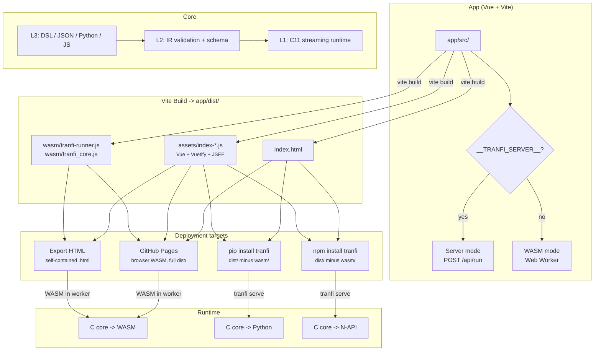

# tranfi

Tranfi transforms CSV, JSON Lines and plain text as streams. You write a
pipeline in a short pipe language, and the same pipeline runs from the command
line, Python, Node.js or the browser. Data flows through in chunks, so most
pipelines use a small, fixed amount of memory however large the input is.

```bash
printf 'name,age\nAlice,30\nBob,25\n' | tranfi -q 'csv | filter "age > 25" | csv'
```

```text
name,age
Alice,30
```

`-q` hides the run statistics that `tranfi` otherwise prints to stderr.

With Tranfi you can:

- Filter, derive, join, aggregate, reshape, validate and profile data.
- Control memory use with limits and disk spill.
- Reuse learned imputation, scaling and category encoding.
- Run pipelines on DuckDB or compile to SQL.

[Try the browser app](https://tranfi.com/app/): WebAssembly, no installation.

## Install

Choose one for your environment:

**Python + CLI**

```bash
pip install tranfi
```

**Node.js + CLI + WebAssembly**

```bash
npm install tranfi
```

The npm package works without Python or a compiler. It uses packaged WebAssembly
when the optional native build is unavailable. The Python package requires
Python 3.9 or newer and a C compiler.

In the browser, import `tranfi/wasm`. `TRANFI_SKIP_NATIVE_BUILD=1` skips the
optional Node native build explicitly.

A standalone C command with a few extra options, such as `--explain`, can be
built from source; see [Build](#build) and the [CLI reference](#cli-reference).

Tranfi is tested on Linux; see [Platform support](#platform-support) for other
systems.

## Quick start

### CLI

```bash
# Keep rows where age > 25, then the 100 oldest
tranfi -q 'csv | filter "age > 25" | top-k 100 age | csv' < data.csv

# Add a computed column
tranfi -q 'csv | derive total=col(price)*col(qty) | csv' < data.csv

# Group and aggregate
tranfi -q 'csv | group-agg city sum:price:total avg:price:avg_price count:*:rows | csv' < data.csv

# Count values
tranfi -q 'csv | frequency city | csv' < data.csv

# Join with a lookup file
tranfi -q 'csv | join lookup.csv on city | csv' < data.csv

# Convert CSV to JSON Lines
tranfi -q 'csv | filter "age > 25" | jsonl' < data.csv

# Search log lines
tranfi -q 'text | grep error | text' < server.log

# Profile a file with built-in recipes
tranfi profile < data.csv
tranfi sniff < data.csv       # schema, types and null counts in bounded memory

# Read and write files instead of stdin and stdout
tranfi -i input.csv -o output.csv 'csv | select name,age | csv'

# List built-in recipes
tranfi -R
```

More examples are in [Examples](#examples). Memory options such as
`--allow-blocking`, `--memory` and `--spill-dir` are covered in
[Streaming and memory](#streaming-and-memory).

### Python ([full docs](py/))

```python
import tranfi as tf

# DSL string
result = tf.pipeline('csv | filter "age > 25" | top-k 100 age | csv').run(input_file='data.csv')
print(result.output_text)

# Builder API
result = tf.pipeline([
    tf.codec.csv(),
    tf.ops.filter(tf.expr("col('age') > 25")),
    tf.ops.top(100, 'age'),
    tf.codec.csv_encode(),
]).run(input_file='data.csv')
```

### Node.js ([full docs](js/))

<!-- readme-test: node-cjs -->
```js
const { pipeline, codec, ops, expr } = require('tranfi')

async function main() {
  // DSL string
  const result = await pipeline('csv | filter "age > 25" | top-k 100 age | csv')
    .run({ inputFile: 'data.csv' })
  console.log(result.outputText)

  // Builder API: the same plan expressed as structured operations.
  const result2 = await pipeline([
    codec.csv(),
    ops.filter(expr("col('age') > 25")),
    ops.top(100, 'age'),
    codec.csvEncode(),
  ]).run({ inputFile: 'data.csv' })
  console.log(result2.outputText)
}

main().catch(error => {
  console.error(error)
  process.exitCode = 1
})
```

### Pipelines or prepared transforms

| Goal | Use | Data and result |
|------|-----|-----------------|
| Filter, derive, join, aggregate, or encode CSV/JSONL/text | CLI or `pipeline(...)` | byte streams in; streamed chunks or collected output bytes/text out |
| Learn reusable imputation, scaling, or category state | prepared transforms | typed columnar batches in; a frozen portable TFTR plan and dense float64 matrix results out |

Start with `pipeline(...)` for ordinary data processing. Use prepared transforms
when a step must learn from reference data and then be applied to new data
without changing.

### Prepared reusable transforms

Learn preprocessing once, then reuse it on new data. For example, fill missing
values with the reference data's mean and scale later batches with the same
learned statistics.

1. **Analyze** reference batches using a recipe.
2. **Finalize** an immutable plan containing the learned values and input/output schemas.
3. **Apply** that plan to compatible batches, or export it for another supported binding.

| Task | Supported methods |
|------|-------------------|
| Fill missing numeric values | Zero, constant, mean, exact median, or leave missing |
| Scale numeric values | Standard, min-max, or no scaling |
| Handle categories | Mode imputation; label or one-hot encoding; discovered or fixed numeric dictionaries |
| Choose numeric or categorical handling | Optional inference from finite integer values and a category limit |

Inputs are typed `float32`/`float64` columns. String categories, categorical
constant imputation, and fixed dictionaries combined with kind inference are
not supported yet.

Start with the [Node/WASM](js/#prepared-reusable-transforms) or
[Python](py/#prepared-reusable-transforms) example.

<details markdown="1">
<summary>Fitting, replaying data and saving plans</summary>

Analysis plus finalization corresponds to `fit`; applying a plan corresponds to
`transform`. To transform the reference data itself (`fit_transform`), replay it
through the finalized plan in a second pass.

Plans store learned state, resolved operations and frozen schemas in the portable
TFTR format. Export from one supported binding and import into another.
`plan.recipeSha256()` / `plan.recipe_sha256()` identify the canonical recipe and
input schema without parsing private artifact bytes.

Prepared transforms use typed tables. The ordinary byte-stream pipeline keeps
its separate `create -> push -> finish -> pull` lifecycle.

</details>

<details markdown="1">
<summary>Category inference, missing values and unknown categories</summary>

**Kind inference.** The `finite-integer-cardinality-v1` rule chooses between the
two configured branches without retaining the dataset. It ignores missing/NaN
values. With `2..maxCategories` distinct finite integers it chooses categorical;
zero/one distinct value, a noninteger, or exceeding the limit selects numeric.

**Missing values.** Categorical columns support mode or no imputation. Mode ties
choose the smallest typed value. With both `impute=none` and `encode=none`, finite
values pass through and missing input becomes canonical qNaN. Without imputation,
missing input to an encoder follows its unknown-value policy.

| Encoding | Known categories | Unknown-value policies |
|----------|------------------|------------------------|
| `label` | Zero-based, sorted ordinals | Error (`108`), a noncolliding safe-integer sentinel, or an extra ordinal after known categories |
| `onehot` | Source-ordered category blocks | Error (`108`), an all-zero block, or an appended `other` field |
| `none` with mode imputation | Learned dictionary retained | Unseen finite values fail with code `108` |

Generated fields have deterministic percent-encoded IDs, names and source/category
metadata. Name collisions fail rather than gaining suffixes. Lookup canonicalizes
zero; a known, nonmissing `-0` retains its sign in pass-through float64 output.
See the binding guides for the tagged format of fixed finite numeric dictionaries.

</details>

<details markdown="1">
<summary>Memory limits, errors and cancellation</summary>

Exact median respects allocation and resident-state limits. Inference, category
discovery and output expansion also enforce category and output-width limits.
Host-policy and spill settings are reserved: a non-null host policy or nonempty
spill path fails with unsupported-runtime code `113`.

Native Node, standalone WASM/Worker, raw WASM and Python share plan/schema bytes,
output/error semantics, resource limits, deterministic disposal and numeric
`TranfiTransformError.code` values.

Runtime options reject unknown fields. Native Node uses `cancelFlag`; standalone
WASM uses `cancelToken`. These spellings are not interchangeable.

</details>

### DuckDB engine

Tranfi pipelines can run on DuckDB instead of the native C core. The DSL is transpiled to SQL in C, so it works across all targets.

```bash
pip install 'tranfi[duckdb]'
```

```python
import tranfi as tf

result = tf.pipeline('csv | filter "age > 25" | sort -age | csv', engine='duckdb').run(input_file='data.csv')
```

```bash
npm install tranfi duckdb
```

```js
import tranfi from 'tranfi'
const { pipeline } = tranfi
const result = await pipeline('csv | filter "age > 25" | sort -age | csv', { engine: 'duckdb' })
  .run({ inputFile: 'data.csv' })
```

<!-- readme-test: browser -->
```js
// Browser (WASM), using an initialized DuckDB-WASM instance and CSV input.
import createTranfi from 'tranfi/wasm'

const tf = await createTranfi()
const result = await tf.runDuckDB(duckdbInstance, 'csv | filter "age > 25" | csv', csvData)
```

Native streaming stays the default; SQL is used only when you select it. DuckDB
is currently the only implemented SQL dialect.

<details markdown="1">
<summary>SQL compatibility details</summary>

Python and Node DuckDB adapters SQL-quote local `input_file` / `inputFile` paths before `read_csv(...)`, including paths with apostrophes.

The CLI exposes the same lowerer as an explicit compile target. Native streaming remains the default; SQL is selected deliberately. Today the implemented dialect is DuckDB, and `--dialect sqlite` / `--dialect postgres` fail clearly until those dialects have their own compatibility rules.

Python `compile_to_sql(..., dialect="duckdb")`, Node `compileToSql(dsl, { dialect: "duckdb" })`, and standalone WASM `compileToSql(dsl, { dialect: "duckdb" })` expose the same boundary; `sqlite` and `postgres` are recognized but rejected, and unknown dialects fail before SQL generation. SQL `frequency` lowering preserves the native `value,count` output shape for explicit columns, including multi-column serialized keys and `\N` null keys; native's no-argument all-column frequency mode is not lowered because the SQL compiler does not know the source schema.

SQL `join`/`semi-join`/`anti-join` lowering preserves full mapped key names for `on=left_col=right_col` instead of truncating generated identifiers. SQL `cast` lowering preserves native `on_error=coerce|null|fail` behavior, numeric `window`/`rolling-*` lowering uses native non-null logical windows instead of plain row frames, and DuckDB result formatting preserves Tranfi-style booleans, nulls, dates, and fractional timestamp strings. Literal `grep` lowering uses typed string `contains()` rather than SQL `LIKE`, so `%`, `_`, and `\` stay literal and non-string columns keep native no-match semantics.

`sample` is native/WASM-only for now: it uses Tranfi's deterministic reservoir algorithm and seed semantics, so SQL rejects it instead of delegating to dialect-specific random sampling. `stats` and its `scan` shorthand are also native/WASM-only until SQL planning can reproduce Tranfi's report schema; SQL rejects them instead of returning dialect-specific summary tables such as DuckDB `SUMMARIZE`.

The same explicit-schema rule applies to schema-dependent convenience forms such as `trim` with no column list: native can trim all runtime string columns, but SQL lowering requires explicit columns until schema-aware SQL planning exists.

SQL compatibility is intentionally conservative:

| Surface | Native/WASM | DuckDB SQL | SQLite/Postgres |
|---------|-------------|------------|-----------------|
| Row/project ops | all row-local streaming ops | supported for explicit-schema `filter`, `select`, default-front `relocate`, `rename`, `derive`, single-expression `validate`, `trim cols`, `fill-null`, `cast`, `clip`, `replace`, `hash`, `bin`, and `grep`; selector helpers and anchored `relocate before/after` reject until SQL planning has schema | recognized but rejected |
| Ordered/window ops | bounded or blocking by contract | supported for `head`, `tail`, `skip`, `sort`, `top`/`top-k`/`bottom-k`, `slice-head`/`slice-tail`/`slice-min`/`slice-max`, `rowid`, `rleid`, `lag`, `lead`, `shift`, `step`, `fill-down`, numeric rolling/window ops, boolean rolling ops, `datetime`, and `date-trunc` | recognized but rejected |
| Aggregation/reshape/set ops | native key-state, sorted, or spill modes | supported for SQL-safe `unique`, `dedup`, `group-agg`, explicit-column `frequency`, `join`/`semi-join`/`anti-join`, all-column `intersect`/`setdiff`/`intersect-all`/`setdiff-all`/`union`/`union-all`, `stack`, `explode`, `split`, `unpivot`, and `pivot`; selected-key set semantics reject because native keeps stable first-left rows | recognized but rejected |
| Native-only contracts | streaming side channels, audits, schema/rule checks, deterministic `sample`, `stats`/`scan`, JSON row ops, `across`, data-prep ops (`ewma`, `diff`, `anomaly`, `interpolate`, `normalize`, `acf`), category encoders, `split-data`, and host metadata (`source-name`) | rejected or not lowered until the SQL output shape and memory contract are equivalent | recognized but rejected |

The C core has a compile-to-SQL compatibility matrix test for these supported and rejected families, while the Python gate runs DuckDB parity on representative SQL-safe pipelines. Treat a successful SQL compile as an explicit target choice, not as a fallback for native streaming features.

</details>

```bash
tranfi --target sql --dialect duckdb 'csv | filter "age > 25" | sort -age | head 10 | csv'
```

The `compileToSql` function is available on all targets for direct SQL generation:

<!-- readme-test: python-api -->
```python
sql = tf.compile_to_sql('csv | filter "age > 25" | sort -age | head 10 | csv',
                        dialect='duckdb')
# WITH
#   step_1 AS (SELECT * FROM input_data WHERE ("age" > 25)),
#   step_2 AS (SELECT * FROM step_1 ORDER BY "age" DESC LIMIT 10)
# SELECT * FROM step_2
```

## Streaming and memory

Most Tranfi operations look at one chunk of rows at a time, so memory stays flat
however large the input is. Some keep state that grows with the number of
distinct keys, such as `unique`, `group-agg` and `join`. A few need the whole
input before they can emit anything, such as `sort` and `pivot`. Tranfi knows
which is which before it runs a pipeline:

```bash
# Print the compiled plan, including what each step keeps in memory
tranfi -j 'csv | head 10 | csv'

# A readable report from the standalone C command (build it with make build-c)
./build/tranfi --explain 'csv | sort -score | head 100 | csv'

# Operations that need the whole input are refused by default
tranfi 'csv | sort -score | csv' # readme-test: rejects-blocking

# Allow them explicitly for inputs you know are small
tranfi --allow-blocking 'csv | sort -score | csv'

# Or set a memory budget; operations with bounded state check their estimate against it
tranfi --memory max:64MB 'csv | unique city max_keys=10000 | csv'
tranfi --memory max:64MB 'csv | unique city max_state_bytes=33554432 | csv'
tranfi --memory max:64MB 'csv | unique city mode=approx bloom_bytes=1048576 | csv'

# Write run statistics to a file
tranfi --stats-json run.ndjson 'csv | filter "col(age) > 25" | csv' < data.csv > out.csv
```

The same options exist in Python and Node.js: pass `allow_blocking=True` /
`allowBlocking: true` or `memory="64MB"` / `memory: "64MB"` to `run()`.

<details markdown="1">
<summary>More examples of bounded operations</summary>

```bash
tranfi -j 'csv | top-k 100 score | csv'
tranfi -j 'csv | slice-min score n=100 | csv'
tranfi -j 'csv | unique city max_keys=100000 | csv'
tranfi -j 'csv | unique city max_state_bytes=33554432 | csv'
tranfi -j 'csv | unique city sorted=true | csv'
tranfi -j 'csv | unique city mode=approx bloom_bytes=1048576 bloom_hashes=7 | csv'
tranfi -j 'csv | rowid city max_state_bytes=33554432 | csv'
tranfi -j 'csv | group-agg city sum:amount:total max_groups=50000 | csv'
tranfi -j 'csv | group-agg city sum:amount:total max_state_bytes=33554432 | csv'
tranfi -j 'csv | group-agg city sum:amount:total sorted=true | csv'
tranfi -j 'csv | frequency city max_values=10000 | csv'
tranfi -j 'csv | frequency city max_state_bytes=33554432 | csv'
tranfi -j 'csv | onehot city max_state_bytes=33554432 | csv'
tranfi -j 'csv | label-encode city max_state_bytes=33554432 | csv'
tranfi -j 'csv | intersect lookup.csv max_lookup_bytes=1048576 max_state_bytes=33554432 | csv'
tranfi -j 'csv | join lookup.csv on city max_lookup_bytes=1048576 max_state_bytes=33554432 | csv'
tranfi -j 'csv | union lookup.csv max_state_bytes=33554432 | csv'
tranfi -j 'csv | frequency city max_values=10000 overflow=other other=REST audit audit_limit=1000 | csv'
tranfi -j 'csv | schema infer rows=10000 | csv'
```

</details>

### Spilling to disk

`sort`, and unsorted `unique`, `group-agg`, `pivot`, joins and set operations,
can spill to a temporary directory instead of keeping everything in memory.
Some of them also need a cap; see the details below. The directory must already
exist, belong to the current user and be private:

```bash
mkdir -m 700 -p /tmp/tranfi-spill
```

```bash
tranfi --spill-dir /tmp/tranfi-spill --memory max:64MB 'csv | sort age | csv' < input.csv > sorted.csv
tranfi --spill-dir /tmp/tranfi-spill --memory max:64MB 'csv | unique city | csv' < input.csv > dedup.csv
tranfi --spill-dir /tmp/tranfi-spill --memory max:64MB 'csv | group-agg city sum:sales:total | csv' < input.csv > grouped.csv
tranfi --spill-dir /tmp/tranfi-spill --memory max:64MB 'csv | pivot metric value sum max_categories=100 | csv' < input.csv > wide.csv
tranfi --spill-dir /tmp/tranfi-spill --memory max:64MB 'csv | anti-join lookup.csv on=city | csv' < input.csv > unmatched.csv
tranfi --spill-dir /tmp/tranfi-spill --memory max:64MB 'csv | intersect lookup.csv columns=city | csv' < input.csv > matched-distinct.csv
tranfi --spill-dir /tmp/tranfi-spill --memory max:64MB 'csv | union lookup.csv columns=city | csv' < input.csv > union-distinct.csv
tranfi --spill-dir /tmp/tranfi-spill --memory max:64MB 'csv | unique city | csv'
```

Spilling works in the CLI, Python and Node.js. The WebAssembly build cannot
spill.

<details markdown="1">
<summary>Spill targets, estimates and explain output</summary>

`state_estimate` is a contract-level Big-O estimate. CLI `--explain` prints a `normalized_dsl:` line showing the validated canonical pipeline, including parser aliases and rewrites such as `sort -score | head N` becoming bounded `top`, followed by the human-readable contract summary and an `ir_json:` line containing the validated serialized IR with per-step metadata, including `state_bytes_estimate` or `state_bytes_reason`. The printed step details also show the selected `target` for that run: `native`, `native_spill`, or `duckdb_sql`.

The runtime `stats` side channel reports `execution_target` for native/WASM runs (`native`, `native_spill`, or `wasm`) and derives `state_bytes_estimate` for key-state steps when op-specific caps make a conservative native estimate possible. This is still estimator-based policy, not measured allocator accounting; spill/external choices are implemented for native `sort`, capped unsorted `pivot`, unsorted `unique`/`dedup`, unsorted `group-agg`, capped unsorted `join` inner/left, unsorted `semi-join`/`anti-join`, unsorted `intersect`/`setdiff`/`intersect-all`/`setdiff-all`, and duplicate-eliminating `union`; native spill steps report measured spill byte/run/output counters at runtime.

</details>

### Memory contract

Each IR step exposes four target-independent contract fields:

| Field | Values | Meaning |
|-------|--------|---------|
| `memory_class` | `row_local` | Uses only the current batch and columns. Examples: `filter`, `select`, `derive`, `across`, `clip`, `tee`, `assert`, `quarantine`, `schema`, `json-extract`, `json-filter`, `json-schema`, `json-flatten`. |
| | `bounded_state` | Keeps bounded state from arguments, batch settings, or the previous row key. Examples: `head`, `slice-head`, `tail`, `slice-tail`, global `rowid`, `rowid sorted=true`, `rleid`, `unique sorted=true`, `group-agg sorted=true`, `join`/`semi-join`/`anti-join sorted=true`, sorted set modes, `lead`, `lag`, `shift`, `window`, `rolling-sum`, `rolling-mean`, `rolling-min`, `rolling-max`, `rolling-any`, `rolling-all`, `top`, `top-k`, `bottom-k`, `slice-min`, `slice-max`, `sample`, `stats`, `scan`, `schema-infer`, `pivot categories=... sorted=true`, `union sorted=true`, `union-all`. |
| | `key_state` | Keeps state proportional to distinct keys/categories. Examples: unsorted exact `rowid`, `unique`, `group-agg`, `frequency`, `join`, `semi-join`, `anti-join`, `intersect`, `setdiff`, `intersect-all`, `setdiff-all`, `union`, `onehot`, `label-encode`. `unique mode=approx` and `frequency mode=approx` use configured approximate state instead of exact distinct-key retention. |
| | `blocking` | Current native implementation needs full input or full output before emitting unless an explicit external path is selected. Examples: default `sort`, default `pivot`, `normalize`, `acf`, `table`. |
| | `external` | Uses explicit spill/SQL/external bounded storage. Native `sort`, capped unsorted `pivot`, unsorted `unique`/`dedup`, unsorted `group-agg`, capped unsorted `join` inner/left, unsorted `semi-join`/`anti-join` filtering joins, unsorted `intersect`/`setdiff`/`intersect-all`/`setdiff-all` row-set membership, and duplicate-eliminating `union` can use this path with `--spill-dir`. |
| `emit_class` | `per_batch` | Can produce main output during `push()`. |
| | `on_flush` | Emits main output only at `finish()`. Examples: `tail`, `slice-tail`, `top`, `top-k`, `bottom-k`, `slice-min`, `slice-max`, `sample`, `stats`, `scan`, `schema-infer`, `sort`. |
| | `mixed` | Emits during `push()` and also on `finish()` or side channels. Examples: `group-agg sorted=true`, `pivot categories=... sorted=true`, `union sorted=true`, `union-all`, `tee`, `validate`, `assert`, `quarantine`, `schema`. |
| `schema_class` | `stable` | Output columns are known from input schema. |
| | `parametric` | Output schema depends on explicit arguments. Examples: `select`, `derive`, `schema`, `schema-infer`, `group-agg`, `stats`, `scan`, `pivot categories=...`. |
| | `data_dependent` | Output schema depends on observed data or external files. Examples: CSV/JSONL decode, default `pivot`, `pivot max_categories=...`, dynamic `onehot`, mutating `join`. |
| `state_estimate` | `O(...)` | Static Big-O estimate for retained state, such as `O(1)`, `O(n)`, `O(distinct_keys)`, or `O(input_rows)`. |

<details markdown="1">
<summary>Operator-specific notes</summary>

**Ranking and slicing**

`slice-head` and `slice-tail` are dplyr-style aliases over Tranfi's existing first/last-row operators; `slice-head` emits per batch like `head`, while `slice-tail` retains only the requested trailing rows and emits at flush. `slice-min`/`slice-max` accept explicit `with_ties=false` for dplyr compatibility and reject `with_ties=true` until tie-expanding output has a bounded contract.

Use heap-backed `top N column`, `top-k N column`, `bottom-k N column`, `slice-min column n=N`, or `slice-max column n=N` instead of a full `sort ... | head N` when a single ranking column is enough. The DSL compiler rewrites adjacent single-column `sort -col | head N` to bounded `top` and `sort col | head N` to bounded `bottom-k`; multi-column sorts stay blocking so tie-break semantics are preserved.

**Aggregation and nulls**

`group-agg` now uses hash lookup for exact unsorted groups and preserves group key types in the runtime output instead of converting every key to string. `group-agg sorted=true` is an exact consecutive-group mode for input already grouped by the selected keys: it retains only the current group key and accumulators, emits completed groups when the key changes, and emits the final group at `finish()`.

Aggregate null semantics match the SQL lowering: `count:column:name` counts non-null column values, `count:*:name` counts input rows, `sum`/`avg`/`min`/`max` ignore null inputs, and groups with no non-null values for those numeric aggregates emit null rather than zero. Native CLI execution is strict by default: blocking steps fail unless `--allow-blocking` is set for known-small inputs or a supported external path is selected.

**Spill paths and output order**

Full `sort` can use native external merge sort with `--spill-dir DIR`; adding `--memory max:SIZE` sizes sorted runs. Unsorted `unique`/`dedup` can also use `--spill-dir DIR` for exact stable external dedup: Tranfi sorts spill runs by key plus original ordinal to choose the first row per key, then reorders selected rows by original input ordinal before emitting.

Unsorted `group-agg` can use the same native spill policy for exact high-cardinality aggregation: it sorts spill runs by typed group key, merges all rows for each group into aggregate accumulators, then emits completed groups in first-seen input order.

Unsorted `pivot` can use native spill when `categories=...` or `max_categories=N` bounds the output columns: Tranfi spills rows, discovers or validates category names, sorts by pass-through key plus category, aggregates each wide cell, then emits wide rows in first-seen group order.

Unsorted `join` inner/left can use native spill when `max_matches_per_row` is set: Tranfi spills left rows and full lookup rows, sorts by typed key, buffers only the current lookup-key run, and emits joined rows in original left order with lookup duplicate order preserved.

Unsorted `semi-join`/`anti-join` and unsorted `intersect`/`setdiff` can use native spill for exact external membership: Tranfi spills left rows and lookup keys, sorts by typed key, compares membership externally, then emits kept left rows in original input order. Spill-backed `intersect`/`setdiff` also collapse duplicate left keys and preserve the first distinct left row per selected key.

Spill-backed `intersect-all`/`setdiff-all` keep bag multiplicity externally: Tranfi emits `min(left_count, lookup_count)` or `max(left_count - lookup_count, 0)` left rows per key, then merges kept rows by original left ordinal. Duplicate-eliminating `union` can use native spill too: Tranfi spills left rows followed by file rows, sorts by typed key plus encounter ordinal, keeps the first row per key, then emits selected rows in original left-then-file order.

Other blocking/key-state steps still reject native byte caps until they have spill/external implementations; uncapped dynamic pivot remains rejected because output columns are unbounded.

**Caps and approximate modes**

Exact `rowid` with unsorted keys, unsorted `unique`/`dedup`, unsorted `group-agg`, `frequency`, `onehot`, `label-encode`, `join`, `intersect`, `setdiff`, `intersect-all`, `setdiff-all`, and `union` can now be bounded with `max_keys`, `max_state_bytes` for `rowid`, `unique`/`dedup`, `group-agg`, `frequency`, `onehot`, `label-encode`, hash-backed joins, duplicate-eliminating set hash state, and bag-count lookup state, `max_groups`, `max_values`, `max_categories`, `max_lookup_rows`, `max_lookup_keys`, `max_lookup_bytes`, `max_matches_per_row`, `max_output_rows`, and `max_output_keys`; exceeding a cap fails fast with a specific pipeline error.

`unique`/`dedup mode=approx` is the explicit probabilistic alternative: it uses a Bloom filter capped by `bloom_bytes` (default `1048576`) and `bloom_hashes` (default `7`), emits during `push()`, drops definite duplicates, and may drop first occurrences when the Bloom filter has false positives. It is incompatible with `sorted=true`, `spill_dir`, `max_keys`, and exact `max_state_bytes`.

`frequency mode=approx max_values=N` is the bounded heavy-hitter alternative for high-cardinality value counts: it retains at most `N` candidate keys, emits `value,count,error` at flush, and reports estimated counts where `count - error` is a lower bound. Row-expanding reshape ops have their own explicit guards: `explode` accepts `max_tokens_per_row`, `max_output_rows_per_input_row`, `max_output_rows_per_batch`, and `max_token_bytes`; `unpivot` accepts `max_output_rows_per_input_row` and `max_output_rows_per_batch`. Exceeding those caps fails fast instead of letting a single cell or wide row expand output without a declared bound.

**Grouped input and measured state**

`unique sorted=true` / `dedup sorted=true` is an exact adjacent-run mode for input already grouped by the selected key: it keeps the first row of each run, drops only adjacent duplicates, and allows native `--memory` without `max_keys`. `group-agg sorted=true` similarly allows native `--memory` without `max_groups`; if a key appears again after a different key, it starts a new output group rather than merging with the earlier run.

Unsorted `rowid ... max_state_bytes=N` enforces measured retained key-counter hash bytes after each new key and can satisfy native memory policy without `max_keys`. Unsorted `group-agg ... max_state_bytes=N` enforces measured retained group hash/key-batch/accumulator bytes after each new group and can satisfy native memory policy without `max_groups`. `frequency ... max_state_bytes=N` enforces measured retained value-hash bytes after each newly tracked value and can satisfy native memory policy without `max_values`.

`onehot ... max_state_bytes=N` and `label-encode ... max_state_bytes=N` enforce measured retained category-table bytes after each newly tracked category and can satisfy native memory policy without `max_categories` or declared `categories`. `frequency` can instead use `max_values=N overflow=other other=LABEL` to retain the first `N` exact values and collapse later novel values into one additional bucket.

Add `audit audit_limit=N` to emit bounded `category_overflow` records for later novel values that are collapsed, with source value, bucket, row number, cap, tracked-value count, and row data governed by the shared audit privacy controls. Rows whose value equals `LABEL` are counted in that same bucket without being audited as overflow, so choose a reserved label when exact source labels matter.

Capped key-state plans get a conservative CLI `state_bytes_estimate` and are rejected when that estimate exceeds `--memory max:SIZE`; uncapped key-state plans still fail under `--memory`. `onehot` and `label-encode` also accept declared `categories`, `max_categories`, `max_state_bytes`, and `unknown=error|other|null`; declared categories make the category state explicit and keep `onehot` output columns stable.

**Join and set memory**

Exact mutating `join` uses an in-memory lookup hash table when caps permit it, with `max_state_bytes=N` enforcing measured retained lookup hash plus retained lookup-batch bytes and separate output guards for duplicate-match explosions; with `--spill-dir` / `spill_dir` and `max_matches_per_row=N`, unsorted inner/left joins use external sorted runs and retain only one bounded lookup-key run in memory.

Unsorted hash joins compare typed keys instead of text-rendered values, so string `1` does not match numeric `1`, null keys do not collide with literal sentinel strings such as `\N`, and known left/lookup join-key schemas must have the same type. `join sorted=true`, `semi-join sorted=true`, and `anti-join sorted=true` are explicit sorted-input modes: Tranfi streams the lookup CSV forward, validates both sides are nondecreasing by the join key, and retains only the current lookup-key run.

Mutating sorted `inner`/`left` joins require `max_matches_per_row` so duplicate lookup runs stay bounded; filtering sorted joins preserve the main schema and never multiply rows. Unsorted filtering joins can also use `--spill-dir` for exact external membership when the lookup key set is too large for memory; mutating `inner`/`left` spill uses the same external path but requires `max_matches_per_row` because matches multiply output rows.

`intersect sorted=true` and `setdiff sorted=true` apply the same sorted-lookup idea to duplicate-eliminating row-set membership: both sides are validated as nondecreasing by the selected key, duplicate left-key runs collapse to the first row, and only previous/current keys are retained. `intersect-all sorted=true` and `setdiff-all sorted=true` keep counts for only the current lookup-key run and current left-key run, so bag-count set membership stays bounded for pre-keyed inputs.

`union sorted=true` is the bounded duplicate-eliminating merge form for pre-keyed inputs: Tranfi validates both sides as nondecreasing, collapses duplicate runs, prefers the left row on equal keys, emits sorted file-only keys during `push()` or `finish()` as ordering permits, and retains only previous/current keys plus the current right row.

`union-all` streams the left side during `push()` and appends the file side during `finish()` without duplicate state; default unsorted `union` uses `max_output_keys` or exact `max_state_bytes` to cap duplicate-eliminating output hash state, can use `--spill-dir` for exact external duplicate elimination, and `max_lookup_rows` / `max_lookup_bytes` can guard the appended file scan.

Default unsorted `intersect-all` emits up to `min(left_count, lookup_count)` left rows per key and `setdiff-all` emits `max(left_count - lookup_count, 0)` rows per key using capped lookup-count state (`max_lookup_keys` or exact `max_state_bytes`, plus `max_lookup_bytes` for native memory policy). With `sorted=true`, the bag-count modes and duplicate-eliminating union retain only current/previous run state and need no lookup/output-key caps under native memory policy. Capped pivot spill is implemented for declared or capped category sets; uncapped dynamic pivot remains rejected.

Partitioned hash-spill join is still a possible optimization, but exact sort-merge mutating join spill is implemented. `--spill-dir` now supports native `sort`, capped unsorted `pivot`, unsorted `unique`/`dedup`, unsorted `group-agg`, capped unsorted `join` inner/left, unsorted `semi-join`/`anti-join`, unsorted `intersect`/`setdiff`/`intersect-all`/`setdiff-all`, and duplicate-eliminating `union`, and fails clearly for operators that do not yet have native spill support.

Native spill files are created through a shared secure spill subsystem: the configured root must be owned by the current user and must not be world-writable without sticky-bit protection; Tranfi creates a private `0700` session directory below it, opens run files with exclusive/no-follow semantics at mode `0600`, and removes the private run files/session directory after merge or pipeline teardown. Create example roots such as `/tmp/tranfi-spill` as user-owned directories; do not pass `/tmp` directly.

Browser/WASM still rejects native spill because C filesystem spill would live in WASM memory.

Full `sort` is stable in native memory and native spill modes: rows whose sort keys compare equal keep their original input order.

For CSV inputs where null-only early batches leave an aggregate column string-typed, numeric `group-agg` parses full numeric string cells; nonnumeric string, bool, date, or timestamp cells fail instead of being treated as zero. `count:column` still counts non-null cells.

</details>

### Run statistics

Every run reports what it did as newline-delimited JSON. The CLI prints it to
stderr; hide it with `-q` or write it to a file with `--stats-json FILE`. In
Python and Node.js it is `result.stats_text` / `result.statsText`.

For `csv | unique city | csv` on a three-row file (shortened):

```text
{"rows_in":3,"rows_out":2,"bytes_in":47,"bytes_out":36}
{"type":"step_stats","steps":[{"index":1,"op":"unique","memory_class":"key_state","warnings":["unbounded_state"],"rows_in":3,"rows_out":2,...}]}
```

The first line summarizes the whole run. The second has one entry per step.
`filter` and `grep` also write a short `{"op":...,"rows_in":...,"rows_out":...}`
line before the summary.

| Field | Meaning |
|-------|---------|
| `index`, `op` | Step position and operation name |
| `rows_in`, `rows_out`, `batches_in`, `batches_out` | What went into and came out of the step |
| `memory_class`, `emit_class`, `schema_class`, `state_estimate` | The step's [memory contract](#memory-contract) |
| `state_bytes_estimate`, `state_bytes_reason` | Estimated retained bytes, or why no estimate is possible |
| `execution_target` | `native`, `native_spill` or `wasm` |
| `warnings` | Any of `blocking`, `flush_latent`, `unbounded_state`, `data_dependent_schema` |

Steps that keep state add measured counters such as `tracked_keys` and
`retained_state_bytes`, steps that spill add spill counters, and validation
steps add pass and fail counts.

<details markdown="1">
<summary>Statistics fields by operation</summary>

Spill counters are `spill_bytes`, `spill_runs`, `spill_output_batches` and
`spill_output_rows`.

- `rowid` with key columns: `tracked_keys`, `tracked_key_bytes`,
  `retained_state_bytes`, `max_state_bytes`.
- `unique` / `dedup`: `tracked_keys`, `tracked_key_bytes`,
  `retained_state_bytes`, `max_state_bytes`. With spill: spill counters and
  `spill_distinct_rows`. In approximate mode: `approximate`, `bloom_bytes`,
  `bloom_bits`, `bloom_hashes`, `approx_inserted`, `approx_filtered`.
- `group-agg`: `tracked_groups`, `tracked_key_bytes`, `retained_state_bytes`,
  `max_state_bytes`. With spill: spill counters and `spill_distinct_groups`.
- `pivot`: `tracked_categories`. With spill: spill counters,
  `spill_distinct_groups` and `tracked_key_bytes`.
- `join`, `semi-join`, `anti-join`: `lookup_rows`, `lookup_keys`,
  `lookup_key_bytes`, `lookup_row_refs`, `lookup_batch_bytes`,
  `retained_state_bytes`, `max_state_bytes`. With spill (inner/left joins,
  semi-join, anti-join): spill counters and `spill_kept_rows`.
- `intersect`, `setdiff`, duplicate-eliminating `union`: `lookup_keys`,
  `lookup_key_bytes`, `emitted_keys`, `emitted_key_bytes`,
  `retained_state_bytes`, `max_state_bytes`. With spill: spill counters and
  `spill_distinct_rows`; `intersect-all` / `setdiff-all` report
  `spill_kept_rows` instead.
- `frequency`: `tracked_values`, `tracked_key_bytes`, `overflow_count`,
  `retained_state_bytes`, `max_state_bytes`. In approximate mode:
  `approximate` and `approx_replacements`, and the output columns are
  `value,count,error`.
- `onehot`, `label-encode`: `tracked_categories`, `category_value_bytes`,
  `retained_state_bytes`, `max_state_bytes`; `onehot` also reports
  `category_output_name_bytes`.
- `validate`: `checked_rows`, `passed_rows`, `failed_rows`, `audit_emitted`,
  `rule_count`, and counters for each rule.
- `schema`: `checked_rows`, `passed_rows`, `failed_rows`, `violation_count`,
  `audit_emitted`, and `required_failures`, `type_failures`,
  `nullable_failures`, `values_failures`, `min_failures`, `max_failures`,
  `regex_failures`, `schema_failures`. With a baseline: `baseline_mode`,
  `allow_extra_columns`, `require_values_seen`, `extra_column_failures`,
  `missing_category_failures`.
- Aggregate `assert`: `assert_mode` (`"aggregate"`), `aggregate`,
  `aggregate_column`, `comparison`, `threshold`, `tolerance`,
  `relative_tolerance`, `aggregate_value`, `aggregate_rows`,
  `aggregate_non_null`, `aggregate_missing`, `aggregate_passed`.

Byte counters measure Tranfi's own storage for keys and state, not allocator
overhead. `max_state_bytes` is enforced exactly for `rowid`, `unique`, `dedup`,
`group-agg`, `frequency`, `onehot`, `label-encode`, hash joins, and hash-based
duplicate-eliminating set operations.

</details>

<details markdown="1">
<summary>Audit records</summary>

Some operations can also write one record per affected row when you ask with
`audit=true audit_limit=N`: rows dropped by `filter`, `assert action=filter`,
`schema mode=filter` and `json-schema mode=filter`; `validate` failures;
repaired CSV rows; `tee` snapshots; standalone `quarantine` rows; value changes
from `fill-null`, `replace`, `cast` and `normalize`; and `frequency
overflow=other` overflows. Records are JSON Lines with a stable `event` name,
the source row number, operation details and, optionally, the row itself.

They
go to the `stats`, `errors` or `samples` channel, depending on the operation. The row payload can be omitted, limited to some columns, redacted, hashed or
truncated with the audit privacy options described under `schema`.

</details>

### Embedding and host policies

<details markdown="1">
<summary>Output draining, file-access policy and low-level APIs</summary>

Python, Node, and standalone WASM wrappers drain main output after each native/WASM `push()` instead of waiting until `finish()`. `run()` still returns a collected `PipelineResult` by default for small outputs.

For large outputs, use callback or iterator modes: Python `p.run(input_file="data.csv", on_output=writer.write, collect_output=False)` or `p.iter_chunks(...)`; Node `await p.writeTo(writable, { inputFile })`, `p.toReadable({ inputFile })`, `await p.run({ inputStream, onOutput, collectOutput: false })`, or `for await (const chunk of p.iterChunks(...))`; standalone WASM `tf.run(dsl, data, { onOutput, collectOutput: false })` or `tf.iterChunks(...)`; browser hosts can use `tranfi/wasm/worker` to run the same WASM pipeline off the UI thread with transferable chunk messages.

Python and Node host file inputs auto-decompress `.gz` paths in the streaming source adapter; use `compression="none"` / `compression: "none"` to force raw bytes, or `compression="gzip"` / `compression: "gzip"` to force gzip.

Native Python/Node/WASM execution now applies the same strict memory policy shape as the CLI for non-spill runs: blocking steps fail by default, `allow_blocking=True` / `allowBlocking: true` is required for known-small native blocking runs, and `memory="64MB"` / `memory: "64MB"` validates conservative key-state byte estimates for capped key-state plans.

Plan-internal file access is also host-policy gated: local lookup files for `join`/set/`union`/`stack`, `validate rules_file`, and `spill_dir`/`spillDir` are rejected in Python/Node/WASM unless explicitly enabled with `allow_fs=True` / `allowFs: true`; `rules_file` additionally requires `allow_rules_file=True` / `allowRulesFile: true`, and `workspace_root` / `workspaceRoot` pins those paths to a host-approved directory.

The built-in workspace resolver canonicalizes existing paths and rejects canonical paths outside the root, including symlink escapes; on POSIX native builds, resolved plan file reads are also reopened through an internal checked path that rejects a later symlink/path swap before the operator reads the file. This is still a string-path API rather than a host-supplied file-handle API, so embedders that need hostile shared-directory confinement across platforms should keep file access in the host layer.

This policy does not affect `input_file` / `inputFile`, which is a host source adapter rather than a core plan read.

The low-level C constructors and raw WASM exports are policy-neutral compatibility surfaces for already-prepared plans; untrusted hosts should use `tf_pipeline_create_with_host_policy()` plus host memory checks, or the Python/Node/WASM wrappers that apply those checks.

Python and Node native execution support spill-backed `sort`, capped unsorted `pivot`, unsorted `unique`/`dedup`, unsorted `group-agg`, capped unsorted `join` inner/left, unsorted `semi-join`/`anti-join`, unsorted `intersect`/`setdiff`/`intersect-all`/`setdiff-all`, and duplicate-eliminating `union` with `spill_dir`/`spillDir`: Python `run(..., on_output=..., collect_output=False)` uses the C sink callback, while Python `iter_chunks()`, Node `run()`, `iterChunks()`, `toReadable()`, and `writeTo()` use `tf_pipeline_finish_step()` / N-API `finishStep()` to drain after each finish boundary for spill sort, spill pivot, spill unique/dedup, spill group-agg, spill mutating/filtering joins, spill set ops, and spill union.

Standalone WASM still rejects `spillDir` because browser/WASM filesystem spill would occupy WASM memory; use Node native, CLI/direct C, or DuckDB for external spill. DuckDB engines still receive `memory` and `spill_dir`/`spillDir` as external engine settings. The C API also supports automatic per-channel sinks with `tf_pipeline_set_sink()` plus manual callback draining with `tf_pipeline_drain()`, so embedders can stream directly to files, sockets, or host stream adapters without retaining full output in Tranfi buffers.

Node `writeTo()` waits for stream `drain` before more output is pulled.

Multi-file host input stays a source-adapter concern. Python `run(input_files=[...], source_column="src")` and Node `run({ inputFiles: [...], sourceColumn: "src" })` stream paths sequentially through one pipeline, set the current source name before each file, call an input-boundary flush between files, and append the path through the row-local `source-name` op.

The boundary flush is decoder-only: it drains a final buffered CSV/JSONL/text record for that file without finishing transforms or encoders, so a row split at EOF is tagged with the file that produced it. CSV repeated header stripping is explicit codec policy: pass `csv skip_repeated_header=true`, `tf.codec.csv(skip_repeated_header=True)`, or `codec.csv({ skipRepeatedHeader: true })` to drop a later file's first parsed record only when it exactly matches the discovered header. Same-file repeated header-like rows are preserved as data.

Browser Web Workers are a host placement detail, not an IR target. The core contract is `target=wasm`; `tranfi/wasm/worker` provides an optional client/server wrapper around the generic WASM `create/push/pull/finish/free` API. The wrapper supports `run()`, streamed `runChunks()`, browser `runFile()` over `File`/`Blob` chunks, transferable input/output buffers, progress snapshots (`bytesIn`, `bytesOut`, `chunksIn`, `chunksOut`, `phase`, `finished`), propagated stats/error side channels, and `AbortSignal` cancellation between chunk/flush boundaries. Prepared-transform worker calls additionally use a SharedArrayBuffer atomic cell for true in-call cancellation; without SharedArrayBuffer, an owned worker is terminated and recreated so its complete WASM heap is reclaimed rather than reused.

The browser app uses the same streaming boundary for uploaded files: it drains WASM main output after each push/finish step into a bounded preview table (`preview_rows`, default 200) and does not retain the full output string unless the schema explicitly sets `collect_output=true` for a deliberate export/download path.

</details>

## Pipe DSL

Pipelines are `source | transform... | sink`. Codecs (`csv`, `jsonl`) auto-resolve by position.

### Codecs

Choose an input codec at the start and an output codec at the end. They can
differ: `csv | ... | jsonl` converts a CSV pipeline's result to JSON Lines.

| Codec | Use it for | Behavior |
|-------|------------|----------|
| `csv` | Tabular input and output | Detects column types from the initial batch, then freezes the schema |
| `jsonl` | One JSON object per line | Decodes one line at a time; nested objects/arrays can be processed with the JSON transforms below |
| `text` | Logs and other line-oriented text | One string column, `_line`; no field parsing or type detection |
| `table` | Human-readable output | Markdown table; options: `max_width=40`, `max_rows=0` |

**Choose how to handle bad records:**

| Input | Setting | Result |
|-------|---------|--------|
| CSV | Default (`mode=permissive`) | Pads short rows with nulls and truncates long rows to the header width, within the column cap |
| CSV | `mode=strict` | Fails on row/header field-count mismatches |
| CSV | `repair` or `mode=repair` | Repairs mismatches and writes bounded diagnostics to `errors` |
| JSONL | Default (`on_error=skip`) | Skips malformed lines and non-object JSON values |
| JSONL | `on_error=fail` | Stops at the first bad line |
| JSONL | `on_error=warn` | Keeps valid rows and writes diagnostics to `errors` |
| JSONL | `on_error=quarantine` | Routes bad records to `errors` as error-severity diagnostics |

**Two CSV behaviors to account for:** after type discovery, values that do not
parse as the frozen type become null. Decode as strings or use explicit
`cast ... on_error=...` when invalid tokens must be preserved or audited.

An empty result may have **no header**: a filter/join that removes all rows, or a
header-only input, can produce zero bytes. `csv n_max=0 | csv` explicitly
preserves the input header; general empty-result header preservation is pending.

<details markdown="1">
<summary>CSV options: delimiters, headers, nulls and skipped rows</summary>

| Need | Setting | Behavior |
|------|---------|----------|
| Another delimiter | `delimiter=;` | Uses the specified field separator |
| No header in the file | `header=false` | Treats the first record as data; names columns `col1`, `col2`, … from its width |
| Extra null markers | `nulls=NA,NULL` | Adds sentinels to the default unquoted-empty-field null handling |
| Preserve quoted null markers | `quoted_nulls=false` | Keeps quoted `"NA"` and `""` as strings |
| Skip a preamble | `skip=N` | Discards N physical records before header/schema discovery and comment handling |
| Limit decoded rows | `n_max=N` or `max_rows=N` | One shared limit after skip/comment/header handling; `0` preserves a schema-only batch, including synthetic names with `header=false` |
| Handle comments | `comment=#` | Removes text after an unquoted marker and skips comment-only rows; quoted markers stay intact |
| Preserve whitespace | `trim_ws=false` | Disables default trimming of unquoted leading/trailing spaces and tabs |
| Drop blank rows | `skip_empty_rows=true` | Default behavior keeps blank physical rows after the header as all-null rows |
| Read multiple CSV shards | `skip_repeated_header=true` | After an explicit input boundary, drops the next non-comment record only if every field matches the original header |

Quoted fields can contain delimiters and newlines; doubled quotes are unescaped.
Quotes inside unquoted fields remain data.

Repeated-header handling requires the host's `tf_pipeline_flush_input()` boundary.
It keeps only schema state, does not scan ahead, and does not remove header-like
rows within a single file.

</details>

<details markdown="1">
<summary>Record limits and diagnostic fields</summary>

CSV, JSONL and text limit the buffered record even before a newline arrives.
All size options must be integers in range; invalid values fail before execution.

| Option | Range | Default / effect |
|--------|-------|------------------|
| `batch_size` | `1..65536` | Sets rows per batch; available on CSV, JSONL and text |
| `max_record_bytes` | `0..1073741824` | `67108864` (64 MiB); `0` disables the record limit |
| `max_error_bytes` | `0..67108864` | Bounds raw previews in diagnostics; available on CSV, JSONL and text |
| `max_columns` (CSV) | `1..65536` | `8192`; exceeding it fails in **every** CSV mode |

Record overflow writes a bounded `csv_record_too_large`,
`jsonl_record_too_large` or `text_record_too_large` diagnostic, then fails.
CSV column overflow reports `csv_too_many_columns`.

Global limits also cap string cells at `67108864` bytes, individual column names
at `4096` bytes and retained schema-name bytes at `16777216`.

| Diagnostics | Fields |
|-------------|--------|
| CSV repair | Line, byte offset, expected/actual field counts, bounded raw preview |
| JSONL errors | Line, action, message, raw byte length, bounded raw preview |

Add `audit audit_limit=N` to CSV repair to emit bounded `row_repaired` records
on `stats` too. This is opt-in; ordinary repair writes only its error diagnostics.
JSONL retains the current line and batch, not the full input, when reporting errors.

</details>

<details markdown="1">
<summary>Numeric precision and CSV type discovery</summary>

CSV and JSONL use round-trip float formatting: finite parsed `float64` values,
including subnormals and negative zero, can be emitted and parsed back with
identical IEEE-754 bits. Float-to-string casts, SQL literals and Python/Node
DuckDB results use the same formatter. Markdown tables use human-readable formatting.

CSV freezes the schema after its initial output batch. Later non-null cells that
cannot parse as the selected `bool`, `int64`, `float64`, `date` or `timestamp` type
become null; later batches do not change the schema.

</details>

### Transforms

| Task | Start with |
|------|------------|
| Keep rows or choose columns | `filter`, `select`, `relocate` |
| Compute or clean values | `derive`, `across`, `fill-null`, `cast` |
| Summarize or rank | `group-agg`, `frequency`, `top-k` |
| Check data quality | `validate` to annotate; `assert` to enforce; `schema` for a column contract |
| Combine datasets | `join`, `semi-join`, `anti-join`, set operations |
| Process sequences | `lag`, `rolling-mean`, `rowid`, `rleid` |
| Work with nested JSON | `json-extract`, `json-filter`, `json-schema`, `json-flatten` |

<details markdown="1">
<summary>Complete transform syntax and SQL equivalents</summary>

| Transform | Syntax | SQL equivalent |
|-----------|--------|---------------|
| `filter` | `filter "col(age) > 25" [audit audit_limit=1000]` | `WHERE age > 25` |
| `select` | `select name,age` | `SELECT name, age` |
| `relocate` | `relocate score` / `relocate score before=age` / `relocate score after=name` | `SELECT score, * EXCLUDE (score)` for default-front |
| `rename` | `rename name=full_name` | `SELECT name AS full_name` |
| `head` | `head 10` | `LIMIT 10` |
| `tail` | `tail 10` | `ORDER BY rowid DESC LIMIT 10` |
| `skip` | `skip 5` | `OFFSET 5` |
| `derive` | `derive total=col(price)*col(qty)` | `SELECT *, price*qty AS total` |
| `source-name` | `source-name src` / `source-file result=src default=unknown` | native/WASM host metadata column |
| `sort` | `sort age` / `sort -age` | `ORDER BY age` / `ORDER BY age DESC` |
| `unique` | `unique name,city` | `SELECT DISTINCT`; `sorted=true` and `mode=approx` are native/WASM-only |
| `stats` | `stats` / `stats count,sum` / `stats count,distinct` / `stats count,missing,complete_rate` | native/WASM bounded online profile; SQL rejects until report shape is equivalent |
| `scan` | `scan` / `scan count,missing,complete_rate` | native/WASM bounded profile |
| `validate` | `validate "col(age) > 0" [audit audit_limit=1000] [audit_include_row=false] [audit_columns=a,b] [audit_redact=a,b] [audit_hash_columns=a,b] [audit_max_bytes=N] [audit_max_cell_bytes=N] [max_failures=N] [warn_failure_rate=R] [max_failure_rate=R]`; rule sets: `validate rule=age_ok:col(age)>0 rule=adult:col(age)>=18` or `validate rules_file=quality.json` | single-expression form lowers to `SELECT *, (...) AS _valid` |
| `assert` | `assert "col(age) > 0" action=filter name=age_positive audit audit_limit=1000 [audit_columns=a,b] [audit_redact=a,b]`; aggregate checks: `assert aggregate=count op=>= value=1` / `assert aggregate=sum:amount op=>= value=1000 tolerance=1e-12 rel=true` / `assert aggregate=missing_rate:score op=<= value=0.05` | native/WASM only |
| `quarantine` | `quarantine "col(age) < 0" name=bad_age message=negative_age [audit_include_row=false] [audit_columns=a,b] [audit_redact=a,b] [audit_hash_columns=a,b] [audit_max_bytes=N] [audit_max_cell_bytes=N]` | native/WASM side output |
| `tee` | `tee "col(age) >= 30" channel=samples columns=name,age limit=1000 [audit_include_row=false] [audit_columns=a,b] [audit_redact=a,b] [audit_hash_columns=a,b] [audit_max_bytes=N] [audit_max_cell_bytes=N]` | native/WASM side output |
| `schema` | `schema name:string age:int non_null=name,age max=age:120 mode=filter audit audit_limit=1000` | native/WASM only |
| `schema infer` | `schema infer rows=10000` / `schema-infer guess_max=1000` | native/WASM bounded schema report |
| `trim` | `trim name,city` (`trim` with no columns is native/WASM only) | `SELECT * REPLACE (TRIM(name) AS name, TRIM(city) AS city)` |
| `fill-null` | `fill-null age=0 city=unknown [audit audit_limit=1000] [audit_columns=a,b] [audit_redact=a,b]` | `COALESCE(age, 0)` |
| `fill-down` | `fill-down city` | `LAST_VALUE(city IGNORE NULLS) OVER (...)` |
| `cast` | `cast age=int score=float [on_error=coerce\|fail\|null] [audit audit_limit=1000] [audit_columns=a,b] [audit_redact=a,b]` | `CAST(age AS INT)` |
| `clip` | `clip score 0 100` / `clip score min=0 max=100` | `GREATEST(0, LEAST(100, score))` |
| `replace` | `replace name Alice Alicia [audit audit_limit=1000] [audit_columns=a,b] [audit_redact=a,b]` | `REPLACE(name, 'Alice', 'Alicia')` |
| `hash` | `hash name,city` | - |
| `bin` | `bin age 18,30,50 [missing=null\|ignore\|error] [on_type_error=null\|fail]` | `CASE WHEN age < 18 THEN ... END` |
| `step` | `step price running-sum cumsum [missing=null\|ignore\|error] [on_type_error=null\|fail]` | `SUM(price) OVER (ROWS UNBOUNDED PRECEDING)` |
| `lead` | `lead price 1 next_price` | `LEAD(price, 1) OVER (ORDER BY ...)` |
| `lag` | `lag price 1 prev_price` | `LAG(price, 1) OVER (ORDER BY ...)` |
| `shift` | `shift price 1 prev_price` / `shift price 1 next_price type=lead` | `LAG(...)` / `LEAD(...)` |
| `rowid` | `rowid` / `rowid city result=city_n max_keys=10000` / `rowid city max_state_bytes=33554432` / `rowid city sorted=true` | `ROW_NUMBER() OVER (...)` |
| `rleid` | `rleid city,status result=run_id` | cumulative run counter over `LAG(...)` |
| `window` | `window price 3 avg price_ma3 [missing=null\|ignore\|error] [on_type_error=null\|fail]` | `AVG(price) OVER (ROWS 2 PRECEDING)` |
| `rolling-sum` / `rolling-mean` | `rolling-sum price 3 sum3 [missing=...] [on_type_error=...]` / `rolling-mean price 3 ma3` | `SUM/AVG(...) OVER (ROWS 2 PRECEDING)` |
| `rolling-min` / `rolling-max` | `rolling-min price 3 min3 [missing=...] [on_type_error=...]` / `rolling-max price 3 max3` | `MIN/MAX(...) OVER (ROWS 2 PRECEDING)` |
| `rolling-any` / `rolling-all` | `rolling-any flag 3 any3 nulls=propagate` / `rolling-all flag 3 all3` | `BOOL_OR/BOOL_AND(...) OVER (ROWS 2 PRECEDING)` |
| `explode` | `explode tags ,` | `UNNEST(SPLIT(tags, ','))`, preserving native NULL-cell pass-through |
| `split` | `split name " " first,last` | `SPLIT_PART(name, ' ', 1) AS first` |
| `unpivot` | `unpivot jan,feb,mar` | `UNPIVOT (value FOR variable IN (...))` |
| `pivot` | `pivot metric value sum` / `pivot metric value sum categories=x,y sorted=true` | `PIVOT`; declared `categories=...` lowers to an ordered `IN (...)` list |
| `top` / `top-k` | `top 10 score` / `top-k 10 score` | `ORDER BY score DESC LIMIT 10` |
| `bottom-k` | `bottom-k 10 score` | `ORDER BY score ASC LIMIT 10` |
| `slice-head` / `slice-tail` | `slice-head n=10` / `slice-tail 10` | `LIMIT 10` / row-number tail |
| `slice-min` / `slice-max` | `slice-min score n=10 with_ties=false` / `slice-max score 10` | `ORDER BY score ASC/DESC LIMIT 10` |
| `sample` | `sample 100` / `sample 100 seed=123` / `sample 100 seed=random` | native/WASM deterministic reservoir; SQL rejects |
| `group-agg` | `group-agg city sum:price:total` / `group-agg city count:*:rows count:price:n` / `group-agg city sum:price:total sorted=true` | `SELECT city, SUM(price) AS total, COUNT(*) AS rows GROUP BY city` |
| `frequency` | `frequency city` / `frequency city mode=approx max_values=1000` / `frequency city max_values=10000 overflow=other other=REST audit audit_limit=1000 [audit_include_row=false] [audit_columns=a,b] [audit_redact=a,b] [audit_hash_columns=a,b] [audit_max_bytes=N] [audit_max_cell_bytes=N]` (approx/overflow/audit native/WASM only) | explicit-column SQL emits exact native-shaped `value,count`; multi-column keys are serialized with the native separator |
| `grep` | `grep error` / `grep -r "^err"` | literal `contains(CAST(col AS VARCHAR), ...)` / regex match |
| `datetime` | `datetime date year,month,day [missing=null\|ignore\|error] [on_type_error=null\|fail]` | `EXTRACT(YEAR FROM date)` |
| `date-trunc` | `date-trunc ts month [result=month_start] [missing=null\|ignore\|error] [on_type_error=null\|fail]` | `DATE_TRUNC('month', ts)` |
| `join` | `join lookup.csv on=city max_lookup_rows=10000 max_lookup_bytes=1048576 max_state_bytes=33554432 max_matches_per_row=10 max_output_rows=100000` / `join lookup.csv on city` | `JOIN lookup ON city = city` |
| `semi-join` / `anti-join` | `semi-join lookup.csv on city` / `anti-join lookup.csv on=city` / `semi-join lookup.csv on city sorted=true` | `WHERE EXISTS (...)` / `WHERE NOT EXISTS (...)` |
| `intersect` / `setdiff` / `intersect-all` / `setdiff-all` / `union` / `union-all` | `intersect other.csv` / `setdiff old.csv columns=id max_lookup_bytes=1048576 max_output_keys=100000` / `intersect-all old.csv columns=id max_lookup_bytes=1048576 max_lookup_keys=100000` / `union other.csv max_output_keys=100000` / `union-all other.csv` | `INTERSECT` / `EXCEPT` / `INTERSECT ALL` / `EXCEPT ALL` / `UNION` / `UNION ALL` for all-column form |
| DSL aliases | `mutate`, `summarise`/`summarize`, `distinct`, `arrange` | normalize to `derive`, `group-agg`, `unique`, `sort` in compiled IR |
| `stack` | `stack other.csv` | `UNION ALL`; streams the appended file in bounded finish chunks, and missing append files fail instead of silently skipping |
| `json-extract` | `json-extract /user/id user_id type=int` / `json-extract payload $.city city` | native/WASM only |
| `json-filter` | `json-filter /user/age >= 30 type=float` / `json-filter payload $.city == NY` | native/WASM only |
| `json-schema` | `json-schema required=user types=user:object mode=filter audit audit_limit=1000 [audit_include_row=false] [audit_columns=_line] [audit_redact=_line]` | native/WASM only |
| `json-flatten` | `json-flatten fields=/user/id:user_id:int,$.user.name:name` / `json-flatten payload fields=$.city:city,$.zip:zip:int` | native/WASM only |
| `flatten` | `flatten` | - |
| `ewma` | `ewma price 0.3 [missing=null\|ignore\|error] [on_type_error=null\|fail]` | - |
| `diff` | `diff price` / `diff price 2` / `diff price order=2 result=price_d2 [missing=null\|ignore\|error] [on_type_error=null\|fail]` | - |
| `anomaly` | `anomaly price 3.0 [missing=null\|ignore\|error] [on_type_error=null\|fail]` | - |
| `interpolate` | `interpolate price linear [missing=null\|ignore\|error] [on_type_error=null\|fail]` | May retain pending null rows until the next value or finish; checked pending-row growth. |
| `normalize` | `normalize price,score minmax [audit audit_limit=N] [audit_columns=a,b] [audit_redact=a,b] [missing=null\|ignore\|error] [on_type_error=null\|fail]` | Blocking/on-flush; opt-in bounded value-change audit records with privacy controls. |
| `label-encode` | `label-encode city` / `label-encode city city_id categories=NY,LA unknown=other` | - |
| `onehot` | `onehot city` / `onehot city --drop` / `onehot city categories=NY,LA unknown=null` | - |
| `split-data` | `split-data 0.8` | - |
| `acf` | `acf price 20 [missing=null\|ignore\|error] [on_type_error=null\|fail]` | Blocking/on-flush; buffers numeric values with checked retained-state growth. |

</details>

<details markdown="1">
<summary>Ranking, sorting and operations that buffer input</summary>

`replace` is row-local for substring and POSIX regex forms. Replacement output is bounded by the global string-cell limit, and allocation or over-cap failures abort cleanly instead of emitting a partially changed row.

`normalize` is exact and therefore blocking/on-flush: it buffers retained row copies until final min/max or z-score statistics are known. Those retained rows use the same checked schema/cell-copy paths and global cell/schema byte limits as streaming row-local ops; use host memory policy, DuckDB/SQL, or explicit known-small `allow_blocking` when normalizing large inputs.

`acf` is also exact blocking/on-flush: it buffers the selected numeric values until final lag statistics are computed. Its retained numeric array uses checked capacity growth and checked array reallocation, and lag output rows are exposed only after cell writes and row-count arithmetic succeed. Use memory policy or explicit known-small `allow_blocking` for large series.

`interpolate` can retain a run of pending null rows for backward/linear interpolation until a later non-null value arrives or the stream finishes, so it is treated as a blocking/full-input-risk data-prep op under native memory policy. Pending rows are stored as single-row batch copies, the pending-row array grows through checked capacity helpers, and emitted rows are exposed only after checked cell writes and row-count arithmetic succeed.

Aliases: `reorder` (select), `dedup` (unique).

`top`/`top-k`/`bottom-k`/`slice-min`/`slice-max` require the ranking column to be a non-empty configured name that exists in the first input schema. Missing ranking columns fail the pipeline instead of silently ranking by another column.

`sort`/`arrange` require each sort column to be a non-empty configured name that exists in the first input schema. Missing sort columns fail instead of becoming a no-op sort key.

</details>

<details markdown="1">
<summary>Validation rules and failure thresholds</summary>

`validate "expr" [audit=true] [audit_limit=N] [max_failures=N] [warn_failure_rate=R] [max_failure_rate=R] [name=rule] [message=text]` keeps every row and appends `_valid` as a boolean row-local annotation. For named row-local rule sets, use repeated DSL rules such as `validate rule=age_ok:col(age)>0 rule=adult:col(age)>=18`, pass `rules=[{name,expr,message}, ...]` / `{name: expr}` through JSON/Python/JS, or load a reusable JSON suite with `rules_file=quality.json` / `rulesFile`.

A suite file may be an array of rule objects, an object map of `name: expr`, or an object with optional `name`, `message`, `audit`, `audit_limit`, `max_failures`, `warn_failure_rate`, `max_failure_rate`, and `rules`. Inline pipeline arguments override suite-file metadata, and inline rules/expr are appended to file rules. Rule files are capped at 1 MiB and parsed as JSON only; Tranfi does not embed YAML, pointblank, validate, or Great Expectations runtimes.

Native CLI/Python/Node paths can read local `rules_file`; standalone browser/WASM users should pass inline `rules` unless they explicitly mount/populate a WASM filesystem. A row is valid only when every rule is true; Tranfi evaluates all rules for each row so per-rule counts and bounded audit records can show every failed rule without retaining failed rows.

Its `step_stats` entry reports row-level `checked_rows`, `passed_rows`, `failed_rows`, `failure_rate`, `audit_emitted`, `rule_count`, optional `max_failures` / `warn_failure_rate` / `max_failure_rate`, and a `rules` array with per-rule checked/passed/failed/failure-rate/audit counters. With `audit=true`, false rule evaluations emit bounded `validation_failed` records to the `stats` side channel with `channel:"audit"`, suite/rule name, expression text, optional message, source row number, and row data governed by `audit_include_row`, `audit_columns`, `audit_redact`, `audit_hash_columns`, `audit_max_bytes`, and `audit_max_cell_bytes`.

`max_failures=N` is an O(1) fail-fast row threshold over rows where any rule failed: execution fails once `failed_rows > N`, so `max_failures=0` aborts on the first invalid row and writes a `threshold_exceeded` record to the `errors` side channel. `warn_failure_rate=R` and `max_failure_rate=R` are finish-time thresholds over final `failed_rows / checked_rows`; warnings write `threshold_warning` JSONL to `errors` without failing, while `max_failure_rate` fails at `finish()` with `max_failure_rate_exceeded`.

Because rate thresholds are final checks, per-batch main output may already have been emitted; they do not retain failed rows or delay streaming output. SQL lowering covers only the single-expression annotation form; rule-set audit records, validation counters, rule files, and failure thresholds are native/WASM runtime features. This is intentionally a streaming validation primitive, not a pointblank/validate-style report engine.

</details>

<details markdown="1">
<summary>Assertions: row actions and aggregate checks</summary>

`assert "expr" [action=fail|warn|filter|quarantine|annotate] [name=rule] [message=text] [result=_assert] [audit=true] [audit_limit=N]` evaluates a row-local rule without retaining the input stream.

`fail` aborts on the first failing row and sets the pipeline error; `warn` keeps main output and writes JSONL failure records to the `errors` side channel; `filter` drops failing rows without side output by default, or writes bounded dropped-row audit records to `stats` when `audit=true`; `quarantine` drops failing rows from main output and writes the failing row data to `errors`; `annotate` keeps every row and appends a boolean result column.

Dataset-level aggregate assertions use `assert aggregate=count|sum:col|avg:col|min:col|max:col|missing:col|non_null:col|missing_rate:col|complete_rate:col op=>= value=N action=fail|warn [tolerance=1e-12] [rel=true|false]`. `missing_rate` is `missing / rows`; `complete_rate` is `non_null / rows`; both are null/failed on an empty input because there is no denominator. These are the streaming subset needed for recurring-delivery checks such as minimum row count, maximum null rate, and minimum completeness rate.

Aggregate mode passes input rows through during `push()`, retains only O(1) counters, evaluates at `finish()`, and reports `aggregate_value`, `aggregate_rows`, `aggregate_non_null`, `aggregate_missing`, `aggregate_passed`, `tolerance`, and `relative_tolerance` in `step_stats`. Equality and inclusive comparisons default to relative tolerance `1e-12 * max(1, abs(actual), abs(expected))`; use `rel=false` for absolute tolerance, or `tolerance=0 rel=false` for exact equality. String numeric thresholds may include surrounding whitespace.

Because aggregate `fail` is a finish-time check, main output may already have been emitted; use `warn` for nonfatal quality gates. Aggregate mode deliberately rejects `filter`, `quarantine`, and `annotate` because those require row-level decisions or retained rows. Row mode is `memory_class=row_local`; aggregate mode is dynamically classified as `memory_class=bounded_state`, `state_estimate=O(1) aggregate counters`, `emit_class=mixed`. The op is native/WASM only and is intentionally a streaming validation action rather than a full data-quality reporting runtime.

</details>

<details markdown="1">
<summary>Quarantine: route matching rows to errors</summary>

`quarantine "expr" [name=rule] [message=text] [audit_include_row=true|false] [audit_columns=a,b] [audit_redact=a,b] [audit_hash_columns=a,b] [audit_max_bytes=N] [audit_max_cell_bytes=N]` is a first-class side-output router: rows where `expr` is true are dropped from main output and emitted as JSONL `row_quarantined` records on the `errors` side channel; rows where `expr` is false continue on main output. This differs from `assert action=quarantine`, where `expr` is a validity rule and false rows are quarantined.

`quarantine` records include `type:"quarantine"`, `event:"row_quarantined"`, `reason`, source row number, expression, optional name/message, and row data governed by the shared audit privacy controls. Step stats include `checked_rows`, `kept_rows`, and `quarantined_rows`. The op is row-local and does not retain prior rows; callers still need to drain the `errors` side channel for large quarantines.

</details>

<details markdown="1">
<summary>Schema contracts and recurring-delivery baselines</summary>

`schema [baseline=object] [columns=]name:type,... [required=...] [non_null=...] [nullable=...] [values=col:v1,v2] [min=col:x] [max=col:y] [regex=col:pattern] [allow_extra_columns=true|false] [require_values_seen=true|false] [max_regex_pattern_bytes=N] [max_regex_cell_bytes=N] [mode=fail|warn|filter|quarantine|annotate] [result=_schema] [audit=true] [audit_limit=N] [audit_include_row=true|false] [audit_columns=a,b] [audit_redact=a,b] [audit_hash_columns=a,b] [audit_max_bytes=N] [audit_max_cell_bytes=N]` validates a declared table contract without retaining the input stream. Column presence and declared types are checked once from the incoming batch schema; per-row checks cover non-null cells, allowed values, numeric min/max bounds, and POSIX string regexes.

Regex rules are native POSIX regexes, not a jq/JMESPath/sandboxed pattern runtime: `max_regex_pattern_bytes` defaults to `4096` and rejects oversized patterns at plan creation, while `max_regex_cell_bytes` defaults to `65536` and turns over-cap string cells into ordinary regex rule failures before calling the regex engine. Bounds keep a single huge cell from monopolizing regex matching; normal host progress/cancellation still applies at batch boundaries.

Column positions in `columns`, `required`, `non_null`, `nullable`, `values`, `min`, `max`, and `regex` can be exact names or Tranfi selector expressions: `starts_with(...)`, `ends_with(...)`, `contains(...)`, `matches(...)`, `where(type)`, `all_of(name,...)`, `any_of(name,...)`, schema-order ranges such as `first:last`, negation with `!`/`-`, intersections with `&`, unions with `|`, and parentheses. Examples: `required=!(id:score_read)`, `columns=starts_with(score_)&where(numeric):number`, or list-valued `['starts_with(score_)&!ends_with(raw)']` through JSON/Python/JS.

Map-style schema rules still use `column:value` syntax, so range and boolean selector expressions are clearest in list-valued rules or host APIs when they contain characters that the DSL also uses as separators. `all_of` is strict about missing columns; `any_of` ignores missing names. Selectors expand once against the first incoming schema and then become ordinary exact-column rules; a selector that resolves no columns is an invalid schema contract.

This is deliberately not full tidyselect: no arbitrary R predicates, lambdas, grouped evaluation, or data-dependent selector runtime; `across` is a separate row-local transform. Actions match `assert`: `fail` aborts, `warn` writes JSONL records while keeping rows, `filter` drops failures silently unless `audit=true`, `quarantine` drops failures and writes row data to `errors`, and `annotate` appends a boolean result column.

For non-fail actions, row-local checks continue after the first failed rule so `warn`/`quarantine` error records and `step_stats` can surface every configured row-local violation for that row; row routing still happens once per row. With `mode=filter audit=true audit_limit=N`, `schema` writes bounded dropped-row audit records to the `stats` side channel with the first failed rule, column, expected/actual values, source row number, optional name/message, and row data.

Schema, filter, validate, assert, json-schema, CSV repair, tee, quarantine, fill-null, replace, cast, normalize, and frequency overflow audit/error serialization accept privacy controls: `audit_include_row=false` omits row payloads, `audit_columns=a,b` limits serialized row fields, `audit_redact=a,b` writes `[REDACTED]`, `audit_hash_columns=a,b` writes stable `fnv1a64:` hashes for bucketing, and `audit_max_bytes=N` / `audit_max_cell_bytes=N` cap serialized row payloads and string cells. The hash is not cryptographic.

Local APIs keep row payloads enabled for compatibility; the built-in Node `tranfi serve` `/api/run` wrapper applies `audit_include_row=false` to audit-capable side-channel producers unless the DSL explicitly sets `audit_include_row=true`. Step stats include checked/passed/failed row counts, total violation count, per-rule failure counters, and audit-emitted count. This is a row-local native/WASM data-quality op with `memory_class=row_local`, `emit_class=mixed`, and `schema_class=parametric`; it is deliberately not a full pointblank/Great Expectations/schematic reporting runtime; use `schema infer` for bounded schema discovery instead.

`audit_max_cell_bytes` uses dynamic audit serialization, so caps above 256 bytes are honored instead of being clipped by an internal scratch buffer.

Host APIs and JSON plans can pass a saved recurring-delivery baseline object to `schema`. The baseline uses the same keys as inline schema contracts, for example `{"columns":{"name":"string","city":"string"},"values":{"city":["NY","LA"]}}`; Python/Node callers can load that JSON from a project-owned fixture file and pass it as `tf.ops.schema(baseline=baseline, mode="warn")` or `ops.schema({ baseline, mode: "warn" })`.

Baseline mode is strict by default: listed columns are required, unexpected input columns produce `extra_column` drift records, and declared `values` are both allowlists for new categories and finish-time expected-category coverage checks. Set `allow_extra_columns=true` or `require_values_seen=false` to relax those defaults. Category coverage retains only one byte per declared category and emits `missing_category` at `finish()`; warning mode records drift while preserving output, and fail mode aborts at finish.

The core deliberately does not read a `baseline_file` path: host code owns file access, workspace policy, and browser portability.

```python
import json
import tranfi as tf

with open('delivery_baseline.json', encoding='utf-8') as f:
    baseline = json.load(f)

result = tf.pipeline([
    tf.codec.csv(batch_size=1),
    tf.ops.schema(baseline=baseline, mode='warn', name='delivery_schema'),
    tf.ops.assert_(aggregate='count', op='>=', value=1000, action='warn',
                   name='delivery_row_count'),
    tf.ops.assert_(aggregate='missing_rate:score', op='<=', value=0.01,
                   action='warn', name='score_missing_rate'),
    tf.codec.csv_encode(),
]).run(input_file='delivery.csv')
```

</details>

<details markdown="1">
<summary>Schema discovery</summary>

`schema infer [rows=N]` emits one schema-report row per input column at `finish()` without retaining input rows. It samples at most `rows` decoded rows, defaults to `10000`, and reports `column`, inferred decoded `type`, `nullable`, `non_null`, `rows_seen`, `rows_sampled`, `missing`, `non_missing`, `observed_types`, and `warning`. `warning` includes `sample_limited` when more rows were seen than sampled and `no_non_null_sample` when a column had no non-null sampled values. The alias `schema-infer guess_max=N` is accepted for readr-style vocabulary. This is `memory_class=bounded_state`, `emit_class=on_flush`, `schema_class=parametric`, native/WASM only, and intentionally a report generator rather than automatic type mutation.

</details>

<details markdown="1">
<summary>Sampling</summary>

`sample N [seed=N|seed=random]` keeps a bounded reservoir and emits only at `finish()`. Omitting `seed` is deterministic and equivalent to `seed=0`, so the same pipeline produces identical sampled rows across runs and byte chunk cuts. Use `seed=random` only when nondeterministic sampling is explicitly desired. This is `memory_class=bounded_state`, `emit_class=on_flush`, and native/WASM only.

</details>

<details markdown="1">
<summary>Side-channel snapshots and audit records</summary>

`tee ["expr"] [channel=samples|errors|stats|audit] [columns=a,b] [limit=N] [every=N] [name=label] [include_row=true|false] [audit_include_row=true|false] [audit_columns=a,b] [audit_redact=a,b] [audit_hash_columns=a,b] [audit_max_bytes=N] [audit_max_cell_bytes=N]` preserves the main stream and writes bounded JSONL row snapshots to a side channel. The optional expression controls which rows are copied; `columns=` restricts the snapshot to selected columns, `audit_columns=` further limits serialized payload fields, `every=` takes deterministic every-N sampling, and `limit=` defaults to `1000` so an undrained side channel does not become a second full-output buffer.

`include_row` controls the source-row-number metadata field; `audit_include_row` controls whether the row payload itself is emitted. The default channel is `samples`; `channel=audit` currently writes to the `stats` side channel with `"type":"tee"`.

`filter ... audit audit_limit=N`, `assert ... action=filter audit audit_limit=N`, `schema ... mode=filter audit audit_limit=N`, and `json-schema ... mode=filter audit audit_limit=N` use the same `stats`/audit path for bounded dropped-row records with `"type":"audit"`; `filter`, `assert`, `schema`, `json-schema`, `validate`, CSV repair, `tee`, `quarantine`, `fill-null`, `replace`, `cast`, `normalize`, and `frequency` records accept the shared privacy controls listed above.

`quarantine ...` routes matching rows to `errors` as explicit side output; `validate ... audit audit_limit=N` uses audit records while keeping annotated main rows, `validate ... max_failures=N` adds a fail-fast count threshold, and `validate ... warn_failure_rate=R` / `max_failure_rate=R` adds finish-time rate thresholds; `csv repair audit audit_limit=N` uses it for bounded `row_repaired` records whose raw preview is controlled as pseudo-column `raw`; `fill-null ... audit audit_limit=N`, `replace ... audit audit_limit=N`, and `cast ... audit audit_limit=N` use it for bounded row-local value/coercion records; `frequency ... overflow=other audit audit_limit=N` uses it for bounded `category_overflow` records.

This is `memory_class=row_local`, `emit_class=mixed`, native/WASM only, and deliberately a primitive for sampling/audit/debugging rather than a full provenance report.

</details>

<details markdown="1">
<summary>Source names</summary>

`source-name [result] [default=...]` appends the current host source name as a string column, defaulting to `_source`. The C/WASM host APIs set that value with `tf_pipeline_set_source_name()` / `wasm_pipeline_set_source_name()`; Python `source_column=` and Node `sourceColumn` inject the op automatically for file-list runs. If no host source is set, the op emits the configured default. It is `memory_class=row_local`, `emit_class=per_batch`, `schema_class=parametric`, native/WASM only, and deliberately records source metadata without opening files or becoming a connector.

</details>

<details markdown="1">
<summary>Audit events and cast error policies</summary>

`validate ... audit audit_limit=N` emits bounded `validation_failed` audit records for false rule evaluations while still keeping rows and setting `_valid=false`; records include row number, suite/rule name, expression, optional message, and row payloads governed by the shared audit privacy controls. Named `validate` rule sets also append per-rule counters to `step_stats`. `validate ... max_failures=N` fails the stream once invalid-row count exceeds the configured threshold without retaining failed rows.

`validate ... warn_failure_rate=R` emits a finish-time `threshold_warning` record when the final invalid-row fraction exceeds `R`; `validate ... max_failure_rate=R` emits `max_failure_rate_exceeded` and fails at finish. `fill-null ... audit audit_limit=N` emits bounded `null_filled` audit records with row number, column, `before:null`, `after`, and resulting row data governed by the shared audit privacy controls.

`replace ... audit audit_limit=N` emits bounded `value_changed` records with row number, column, pattern/replacement metadata, before/after strings, and resulting row data governed by the shared audit privacy controls; redacted/hash-protected columns also redact/hash before/after and pattern/replacement metadata.

`cast ... audit audit_limit=N` emits bounded `value_changed` records for successful type casts and `coercion_failed` records for invalid, trailing-character, out-of-range, non-canonical boolean, unsupported, or invalid-target coercions; records include source/target types, expected type, `on_error`, actual source string when available, before/after values, row number, and resulting row data governed by the shared audit privacy controls.

`cast on_error=coerce` is the compatibility default and preserves legacy fallback values such as `0`, partial numeric parses, or `false` while reporting failures when audit is enabled; `on_error=null` writes null for failed coercions; `on_error=fail` aborts at the first failed coercion. Cast step stats include `coercion_failures`, `coercion_nulled`, and `audit_emitted`. `normalize ... audit audit_limit=N` emits bounded `value_changed` records with method/stat context; before/after, row data, and min/max/mean/stddev stats for redacted or hash-protected columns follow the shared audit privacy controls.

These are opt-in audit modes; default execution remains silent, and `normalize` remains blocking/on-flush for exact minmax/zscore normalization. `frequency ... max_values=N overflow=other other=LABEL audit audit_limit=N` emits bounded `category_overflow` records when later novel values are collapsed into the other bucket; records include the source value, bucket label, source row number, configured cap, tracked-value count, and row data governed by the shared audit privacy controls.

If any counted column is redacted or hash-protected, the composite source value is redacted or hashed too. Real source values already equal to `LABEL` are counted in the bucket but are not audited as overflow. CSV repair, `tee`, and standalone `quarantine` side-channel records use the same controls; CSV repair exposes its raw preview to the policy as pseudo-column `raw`.

</details>

<details markdown="1">
<summary>Column profiling</summary>

`scan [stats...]` emits one profile row per input column at `finish()` using bounded online state. With no arguments it reports `count`, `missing`, `complete_rate`, `distinct`, numeric min/max/avg/stddev/quantiles, a compact histogram, and a bounded numeric reservoir sample where applicable. Requested online substates for `distinct`, `hist`, and `sample` are all-or-error under allocation pressure, so Tranfi fails cleanly rather than emitting partial profile columns.

`distinct` is a bounded HyperLogLog estimate, not an exact distinct-count guarantee; use exact `frequency`, `unique`, or `dedup` modes when exact cardinality matters and the key state is bounded or spilled. It is the data-quality/profile shorthand for `stats` plus profile defaults: `memory_class=bounded_state`, `emit_class=on_flush`, `schema_class=parametric`, native/WASM only, and no whole-input retention. `stats` also accepts the profile counters explicitly, for example `stats count,missing,complete_rate`.

</details>

<details markdown="1">
<summary>Extracting JSON fields</summary>

`json-extract [column] path result [type=string|int|float|bool]` parses one JSON text column per row and appends the selected value. The default source column is `_line`, so raw NDJSON can be handled as `text | json-extract /user/id user_id type=int | csv`. For JSONL-decoded nested object or array fields, Tranfi preserves those nested values as compact JSON strings, so `jsonl | json-extract payload $.city city | csv` extracts from the `payload` object without retaining the full file.

Supported paths are JSON Pointer (`/a/b/0`, with RFC-style `~0` and `~1` escapes) plus a small JSONPath-style subset (`$.a[0].b`, `$['a']`, or `a[0].b`); wildcards, filters, and recursive descent are not implemented. Missing paths, invalid JSON, or failed type coercions emit null. The op is `row_local`, emits per batch, and is native/WASM only for now; SQL JSON lowering is intentionally not claimed.

</details>

<details markdown="1">
<summary>Numeric transforms: missing columns and invalid types</summary>

`ewma`, `anomaly`, `bin`, `diff`, `step` numeric functions, and `interpolate` now use strict numeric source semantics: the required source column must exist and must decode as `int` or `float` by default. Use `missing=null` to append the result column filled with nulls when a result-appending op's source column is absent; for in-place `interpolate`, `missing=null` appends the requested missing column filled with nulls.

Use `missing=ignore` to leave the input batch unchanged, or `on_type_error=null` to emit null result values when the source column exists but is not numeric; for in-place `interpolate`, this nulls the source cells. `step running-count` is the count-style exception and can count non-null values from nonnumeric columns.

`ewma` also validates `alpha` in `[0,1]`, `anomaly` requires a non-negative finite threshold, `bin` boundaries must be finite and strictly increasing, `diff` validates positive bounded order values, `step` rejects unknown functions instead of treating typos as `running-sum`, and `interpolate` rejects unknown methods instead of treating typos as `linear`.

Default output names for `bin`, `ewma`, `anomaly`, `diff`, `step`, and numeric/boolean rolling ops use the full source column plus the generated suffix and fail on the global column-name cap rather than truncating.

</details>

<details markdown="1">
<summary>Filtering JSON values</summary>

`json-filter [column] path [op [value]] [type=auto|string|int|float|bool]` keeps rows whose selected JSON value satisfies a row-local predicate. With no `op`, it defaults to `exists`; boolean forms are `exists`, `missing`, `truthy`, and `falsey`. Comparison forms are `==`/`eq`, `!=`/`ne`, `>`/`gt`, `>=`/`ge`, `<`/`lt`, `<=`/`le`, plus string `contains`, `starts-with`, and `ends-with`. Examples: `text | json-filter /user/age >= 30 type=float | csv` and `jsonl | json-filter payload $.city == NY | csv`.

Invalid JSON and missing paths behave as missing values, so they drop out of positive comparisons and pass `missing`/`falsey`. This is not a jq/JMESPath engine; it is a bounded row predicate over the same path subset as `json-extract`.

</details>

<details markdown="1">
<summary>JSON Schema validation</summary>

`json-schema [column] [schema=JSON|true|false] [required=a,b] [types=a:string,b:int] [mode=annotate|filter] [result=_valid] [audit=true] [audit_limit=N] [audit_include_row=true|false] [audit_columns=a,b] [audit_redact=a,b] [audit_hash_columns=a,b] [audit_max_bytes=N] [audit_max_cell_bytes=N]` validates one JSON text cell per row. Host APIs can pass a real schema object with `ops.json_schema(schema, ...)` / `ops.jsonSchema(schema, ...)`; the DSL also has the compact `required=` and `types=` shorthand for object records. `mode=annotate` keeps every row and appends a boolean result column, while `mode=filter` keeps only valid rows.

With `mode=filter audit=true audit_limit=N`, invalid rows are also sampled into bounded `stats` audit records with failure class, source row number, and row data governed by the shared audit privacy controls; invalid-value `actual` fields follow the same redaction/hash/truncation policy. Supported JSON Schema keywords are deliberately limited to boolean schemas, `type`, `required`, `properties`, single-schema `items`, `enum`, `const`, numeric bounds, string length, and array length.

Unsupported keywords such as `$ref`, `oneOf`/`anyOf`, `pattern`, `format`, and `additionalProperties` reject pipeline creation instead of being silently ignored. Invalid JSON or a non-string source column validates as false. This is native/WASM only and row-local; it is not a full JSON Schema engine.

</details>

<details markdown="1">
<summary>Flattening declared JSON fields</summary>

`json-flatten [column] fields=path:name[:type],...` parses one JSON text cell per row and appends all declared fields as new columns while preserving the input row. The default source column is `_line`; host APIs can pass field objects such as `{ path: '/user/id', name: 'user_id', type: 'int' }`, while the DSL uses compact `path:name[:type]` field specs. Supported output types are `string`, `int`, `float`, and `bool`; string fields preserve scalar strings and stringify arrays/objects as compact JSON.

Supported paths are the same JSON Pointer/simple JSONPath subset as `json-extract`. Missing paths, invalid JSON, non-string source columns, or failed type coercions emit null for that declared field. This is a bounded row-local flatten, not recursive object discovery, not a data-dependent schema operation, and not a jq/JMESPath runtime. It is native/WASM only for now.

</details>

<details markdown="1">
<summary>Selecting, moving and transforming columns</summary>

`select` and `relocate` column lists may contain exact names, schema-order ranges such as `id:score_read` or `score_read:id`, `starts_with(prefix)`, `ends_with(suffix)`, `contains(text)`, `matches(regex)`, `where(type)`, strict `all_of(name,...)`, lenient `any_of(name,...)`, exclusions with `!name` or `-name`, and boolean selector algebra with `!`, `&`, `|`, and parentheses. Helper matching is case-insensitive; exact names are case-sensitive. Supported `where` types include `numeric`, `int`, `float`, `string`, `bool`, `date`, `timestamp`, and `temporal`.

Native execution resolves selectors from the input schema in `O(columns)` without retaining rows; `&` preserves the left operand order, `|` appends right-only columns after the left operand, and complements use input schema order. When the input schema is known, selector helpers that resolve no columns are invalid and report a schema-inference error instead of silently creating a zero-column stream.

SQL lowering currently rejects selector helpers and exclusions without a known schema; exact `select` and default-front `relocate` still lower normally. Examples: `select starts_with(score_)&where(numeric)`, `select starts_with(score_)&!ends_with(raw)`, `select !(id:score_read)`, `relocate starts_with(score_) after=name`. Quote selector expressions in shell commands when the shell would treat `!`, `&`, or `|` specially.

`relocate columns [before=column|after=column]` moves named columns while preserving all rows and all columns. Without `before` or `after`, moved columns go to the front. Native execution supports anchored placement; SQL lowering currently supports the default-front form without schema.

`across columns=selector[,selector] fn=function [replace=true|false] [names={col}_{fn}]` applies a deterministic row-local function to every selected column. Compact DSL form is also accepted: `across starts_with(score_) round`. With one function and no `names`, `across` replaces selected columns in place; with `replace=false`, it appends generated columns using `{col}` / `{.col}` and `{fn}` / `{.fn}` name templates.

Supported functions are `trim`, `lower`, `upper`, `abs`, `round`, `floor`, `ceil`, `sqrt`, `log`, and `exp`; string functions require string columns, numeric functions require numeric columns, and incompatible selections fail instead of silently keeping original values. This is `memory_class=row_local`, `emit_class=per_batch`, `schema_class=parametric`, native/WASM only, and intentionally not full dplyr `across()` lambdas, grouped evaluation, function lists with unpacking, or SQL lowering. Examples: `across starts_with(score_) round`, `across columns=name fn=lower replace=false names={col}_{fn}`.

</details>

<details markdown="1">
<summary>Deduplication</summary>

`unique columns sorted=true` and `dedup columns sorted=true` are adjacent-run dedup modes for pre-grouped input. They keep the first row of each consecutive key run and retain only the previous key across chunks. If the same key appears again after a different key, it starts a new run and is emitted again.

Use unsorted `unique ... max_keys=N` for a cardinality cap or `unique ... max_state_bytes=N` for an exact runtime retained-state byte cap when keys are not grouped; both preserve global exact distinct-row semantics until the cap is exceeded. Use `unique ... mode=approx bloom_bytes=N bloom_hashes=K` when bounded memory matters more than exact first-occurrence preservation; this Bloom-filter mode emits per batch and may drop first occurrences on false positives.

</details>

<details markdown="1">
<summary>Set operations and duplicate counts</summary>

`intersect file.csv [columns=...] [max_lookup_rows=N] [max_lookup_keys=N] [max_lookup_bytes=N] [max_output_keys=N] [max_state_bytes=N] [sorted=true] [spill_dir=DIR]`, `setdiff ...`, `intersect-all file.csv [columns=...] [max_lookup_rows=N] [max_lookup_keys=N] [max_lookup_bytes=N] [max_state_bytes=N] [sorted=true] [spill_dir=DIR]`, `setdiff-all ...`, `union file.csv [columns=...] [max_lookup_rows=N] [max_lookup_bytes=N] [max_output_keys=N] [max_state_bytes=N] [sorted=true]`, and `union-all file.csv [max_lookup_rows=N] [max_lookup_bytes=N]` are file-backed set operations.

`intersect` and `setdiff` are left-streaming duplicate-eliminating membership filters against a lookup CSV; default unsorted mode retains `O(lookup_keys + emitted_keys)`, `spill_dir` switches unsorted mode to exact external row-set membership with bounded RAM and flush-time output, and `sorted=true` validates both sides as nondecreasing and retains only previous/current key state.

`intersect-all` and `setdiff-all` are bag-count variants: they preserve left input order and respectively emit up to matching lookup copies or the left copies left after lookup copies are consumed. Default unsorted bag-count mode retains lookup key counts, so use `max_lookup_keys` or exact `max_state_bytes`, plus `max_lookup_bytes` under native `memory=...`; `sorted=true` validates both sides as nondecreasing and retains only the current lookup-key and left-key runs.

`spill_dir` switches unsorted bag-count mode to exact external merge counting with bounded RAM and flush-time output; `step_stats` reports `spill_kept_rows`. `union-all` is the append form: it streams the main input during `push()`, then appends the file rows at `finish()` without duplicate state.

`union` is duplicate-eliminating across main input and file rows; without `columns`, the key is the full row by same-named columns, while `columns=` selects the dedupe key and preserves the first full row for each key. `union sorted=true` is the bounded merge form for inputs sorted by that key: it validates both sides, collapses duplicate runs, prefers the left row when keys match, and emits file-only keys in sorted order.

Under native `memory=...`, sorted union needs no key-state cap; unsorted `union` can use `max_output_keys`, exact `max_state_bytes`, or external `spill_dir`. Unsorted duplicate-eliminating `intersect`/`setdiff` can use `max_state_bytes` instead of `max_output_keys`, but still need `max_lookup_bytes` because the hash lookup loader reads and decodes the lookup CSV before retaining the hash set; with `spill_dir`, they use `spill_memory_bytes`/host `memory` for run sizing instead.

SQL lowering supports only all-column forms as `INTERSECT`, `EXCEPT`, `INTERSECT ALL`, `EXCEPT ALL`, `UNION`, and `UNION ALL`; selected-key native semantics are not lowered to SQL yet.

</details>

<details markdown="1">
<summary>Grouped aggregation</summary>

`group-agg ... sorted=true` is the aggregation version of that contract. It assumes rows for each key are consecutive, keeps only the current key and aggregate accumulators, emits a completed group as soon as a new key arrives, and emits the last group on flush.

Use unsorted `group-agg ... max_groups=N` for a cardinality cap, `group-agg ... max_state_bytes=N` for an exact retained-state byte cap, or native `spill_dir`/`--spill-dir` for exact external aggregation when keys are not consecutive and the cardinality is too large for RAM. When an aggregate name is omitted, native output uses `column_func` with the full source column name and fails on the global column-name cap rather than truncating; SQL lowering uses the same alias shape without fixed-buffer truncation.

</details>

<details markdown="1">
<summary>Date components and truncation</summary>

`datetime column [extract=...]` appends requested component columns such as `column_year`, `column_month`, and `column_day`. Generated component names preserve the full source column name and fail on the global column-name cap rather than truncating.

`date-trunc column unit` replaces the source column by default. Add `result=name` or a positional result name to append a separate truncated column instead; native and SQL lowering follow the same output-schema rule.

</details>

<details markdown="1">
<summary>Pivoting with bounded categories</summary>

`pivot name_column value_column [agg] categories=a,b sorted=true` is the bounded native pivot mode. Declared `categories` fix the output schema for native, WASM, and SQL planning; `sorted=true` additionally means rows for each pass-through key are consecutive, so Tranfi retains only the current wide row and emits completed groups when the key changes, then emits the final group at `finish()`. SQL lowering preserves declared category order by emitting an ordered DuckDB `IN (...)` list.

For direct input pivots without declared categories, SQL lowering derives that list from first-seen input category order. After earlier SQL transforms, dynamic SQL pivot rejects unless `categories=...` is declared, because DuckDB cannot safely bind a prior CTE inside the dynamic category subquery and silently sorted categories would drift from native output order.

For unsorted large pivots, use `--spill-dir DIR` / `spill_dir` with either declared `categories=...` or `max_categories=N`: Tranfi spills rows to sorted runs, discovers or validates the bounded category set, aggregates cells externally, and emits wide rows at flush in first-seen group order. `max_categories=N` bounds width and memory policy but keeps column names data-dependent until input is read; declared `categories=...` is the stable output-schema contract.

Uncapped default `pivot` remains rejected under native memory policy because categories and groups can appear anywhere and output columns are data-dependent without a bound.

</details>

<details markdown="1">
<summary>Rolling windows and lag</summary>

`window` numeric functions plus `rolling-sum`, `rolling-mean`, `rolling-min`, and `rolling-max` are named trailing fixed-row numeric windows. `rolling-any` and `rolling-all` are the boolean counterparts. All include the current row plus the previous `size - 1` rows, compute partial windows for early rows, emit every batch, and retain only `O(size)` state across chunk boundaries. Numeric windows fail by default when the source column is missing or non-numeric; use `missing=null|ignore|error` and `on_type_error=null|fail` to choose explicit opt-out behavior.

Boolean rolling accepts `nulls=ignore|false|true|propagate`; `ignore` skips nulls but returns null for an all-null window, `false`/`true` coerce nulls to that value, and `propagate` returns null when any row in the window is null. Centered windows, adaptive/time windows, and `complete=true` behavior remain future explicit modes.

`lag column [offset] [result]` appends the value from prior rows while preserving the source type and using only `offset` retained rows. `shift` defaults to lag-compatible semantics and accepts `type=lead` for bounded lookahead. Default result names (`column_lag`, `column_shift`, or `column_lead`) use the full source column and fail on the global column-name cap rather than truncating. Both retained history and pending lookahead batches use checked schema/row-copy and row-exposure helpers.

</details>

<details markdown="1">
<summary>Row numbers and run IDs</summary>

`rowid [columns] result=name` appends 1-based row ids. With no columns it is a global bounded counter. With columns it matches data.table-style per-key occurrence counts using key-state memory; add `max_keys=N` to cap distinct keys or `max_state_bytes=N` to enforce measured retained key-counter bytes. If the input is already grouped by the selected columns, `sorted=true` uses only previous-key state and resets when the key changes.

`rleid columns result=name` appends a consecutive-run id for one or more selected columns. It is streaming across chunk boundaries and retains only the previous selected key plus the current id; non-consecutive repeated values intentionally get new ids.

</details>

<details markdown="1">
<summary>Category encoding</summary>

Category encoders keep state proportional to distinct categories unless bounded. Use `categories=a,b,c` when the allowed category set is known, `max_categories=N` to cap learned categories, `max_state_bytes=N` to cap measured retained category-state bytes, and `unknown=error|other|null` to choose how values outside the declared set or cap are handled. With declared categories, `onehot` emits stable columns from the first batch; without them, legacy dynamic discovery remains available but the schema can grow as new categories arrive.

Generated `onehot` column names and default `label-encode` result names are built without fixed-buffer truncation and fail if they exceed the global column-name cap. Declared-category `onehot` and `label-encode` paths are covered by generated-input RSS/output-buffer regressions.

</details>

<details markdown="1">
<summary>Joins: hash, sorted and spill modes</summary>

Join caps are `max_lookup_rows=N`, `max_lookup_keys=N`, `max_lookup_bytes=N`, `max_state_bytes=N`, `max_matches_per_row=N`, and `max_output_rows=N`. Lookup caps bound the unsorted hash-join build side; `max_lookup_bytes` guards the capped hash loader, while `max_state_bytes` enforces measured retained lookup hash state plus retained lookup batch for mutating joins or lookup-key hash state for filtering joins.

Hash-join key equality is typed: known left/lookup join-key schemas must match, string values do not match numeric values with the same printed form, and nulls do not match literal sentinel strings such as `\N`. `max_matches_per_row` rejects duplicate lookup matches that would multiply any main row; `max_output_rows` caps emitted joined rows across the pipeline step. `semi-join` keeps main rows whose key appears in the lookup; `anti-join` keeps main rows whose key is absent.

Filtering joins preserve the main schema, emit at most one output row per input row, and accept header-only empty lookup files. Add `sorted=true` when the lookup CSV and main input are both sorted ascending by the join key: the native engine streams the lookup file forward, validates sorted order on both sides, and retains only the current lookup-key run.

For unsorted large joins, use `--spill-dir DIR` / `spill_dir`: filtering joins spill left rows and lookup keys, while mutating inner/left joins spill left rows and full lookup rows, sort by typed key, and emit at flush in original left-row order. Mutating sorted and spill-backed `join` modes require `max_matches_per_row` to bound duplicate lookup runs; `max_output_rows` remains the global output guard.

Use capped hash joins for known-small reference tables, sorted joins for pre-keyed inputs, and spill-backed joins when lookup-side state would otherwise exceed memory.

</details>

### Expressions

Used in `filter`, `derive`, `validate`, and `assert`:

| Category | Functions | SQL equivalent |
|----------|-----------|---------------|
| Literals | numbers, quoted strings, bare `true` / `false` | numeric, string, boolean literals |
| Columns | `col(name)` | `name` |
| Arithmetic | `+` `-` `*` `/` | same |
| Comparison | `>` `>=` `<` `<=` `==` `!=` | same |
| Logic | `and` `or` `not` | `AND` `OR` `NOT` |
| String | `upper()` `lower()` `initcap()` | `UPPER` `LOWER` `INITCAP` |
| | `len()` `trim()` `left()` `right()` | `LENGTH` `TRIM` `LEFT` `RIGHT` |
| | `concat(a, b, ...)` `replace(s, old, new)` | `CONCAT` `REPLACE` |
| | `slice(s, start, len)` | `SUBSTRING(s, start, len)` |
| | `pad_left(s, w)` `pad_right(s, w)` | `LPAD` `RPAD` |
| Predicates | `starts_with()` `ends_with()` `contains()` | `LIKE 'x%'` `LIKE '%x'` `LIKE '%x%'` |
| | `between(x, left, right)` `inrange(x, left, right)` | `BETWEEN` |
| Date/time | `year(x)` `month(x)` `day(x)` `hour(x)` `minute(x)` `second(x)` | `EXTRACT(...)` |
| | `weekday(x)` `epoch(x)` | `EXTRACT(dow FROM x)` `EXTRACT(epoch FROM x)` |
| | `date_trunc(x, 'year\|month\|day\|hour\|minute\|second')` | `date_trunc(unit, x)` |
| Conditional | `if(cond, then, else)` `case_when(cond, value, ..., default)` | `CASE WHEN ... THEN ... ELSE ... END` |
| | `case_match(value, key, result, ..., default)` | `CASE value WHEN key THEN result ELSE default END` |
| | `if_any(pred, ...)` `if_all(pred, ...)` | `OR` / `AND` reduction |
| | `coalesce(a, b, ...)` `nullif(a, b)` | `COALESCE` `NULLIF` |
| Math | `abs()` `round()` `floor()` `ceil()` `sign()` | `ABS` `ROUND` `FLOOR` `CEIL` `SIGN` |
| | `pow(x, y)` `sqrt()` `log()` `exp()` `mod(a, b)` | `POWER` `SQRT` `LN` `EXP` `MOD` |
| | `greatest(a, b, ...)` `least(a, b, ...)` | `GREATEST` `LEAST` |

Aliases: `substr`=`slice`, `length`=`len`, `lpad`=`pad_left`, `rpad`=`pad_right`, `min`=`least`, `max`=`greatest`. Bare `true` and `false` are boolean literals; quote them as `'true'` or `"true"` when you need string values. Date/time functions are row-local and accept date/timestamp values plus parseable `YYYY-MM-DD` and `YYYY-MM-DDTHH:MM:SS[.frac]Z` strings; `weekday()` returns `0=Sunday` through `6=Saturday`.

### Examples

```bash
# Computed columns
tranfi 'csv | derive total=col(price)*col(qty) | csv'

# Row-local date/time columns
tranfi "csv | derive y=year(col(date)) month_start=date_trunc(col(date),'month') | csv"

# Combined pipeline
tranfi 'csv | filter "col(age) > 25" | sort -score | head 10 | csv'

# Running sum + moving average
tranfi 'csv | step price running-sum cumsum | rolling-mean price 3 ma3 | csv'

# Group by + aggregate
tranfi 'csv | group-agg city sum:price:total avg:price:avg_price count:*:rows count:price:n_prices | csv'

# Value counts
tranfi 'csv | frequency city | csv'
tranfi 'csv | frequency city mode=approx max_values=1000 | csv'
tranfi 'csv | frequency city max_values=10000 overflow=other other=REST audit audit_limit=1000 | csv'
tranfi 'csv | frequency city max_state_bytes=33554432 | csv'

# Extract date parts
tranfi 'csv | datetime date year,month,day | csv'

# String functions in derive
tranfi 'csv | derive upper_name=upper(col(name)) initials=slice(col(name),0,1) | csv'

# Conditional expressions
tranfi "csv | derive label=if(col(age)>25,'senior','junior') | csv"
tranfi "csv | derive band=case_when(col(age)<18,'minor',col(age)<65,'adult','senior') region=case_match(col(city),'NY','east','LA','west','other') | csv"
tranfi 'csv | filter "if_any(col(score1)>90,col(score2)>90)" | csv'

# Regex grep and replace
tranfi 'text | grep -r "^error:.*timeout" | text' < server.log
tranfi 'csv | replace --regex name "A.*e" X | csv'

# Cross-codec
tranfi 'csv | filter "col(age) > 25" | jsonl'

# Text mode: line-oriented, no CSV parsing
tranfi 'text | grep error | text' < server.log
tranfi 'text | grep -v debug | head 100 | text' < app.log

# Data prep: smoothing, differencing, anomaly detection
tranfi 'csv | ewma price 0.3 | diff price | anomaly price 3.0 | csv'
# Numeric data-prep ops fail on missing/non-numeric source columns by default; opt into nulls when desired
tranfi 'csv | ewma price 0.3 on_type_error=null | bin score 10,20,30 missing=null | csv'

# ML preprocessing: encode, normalize, split
tranfi --allow-blocking 'csv | label-encode city city_id categories=NY,LA unknown=other | onehot color categories=red,blue,green unknown=null --drop | normalize score minmax | split-data 0.8 | csv'

# Time series: interpolate nulls, autocorrelation
tranfi --allow-blocking 'csv | interpolate price linear | csv'
tranfi --allow-blocking 'csv | acf price 20 | csv'
```

## Benchmarks

1M rows, single-threaded, best of 3. Times in ms (lower is better).

### Text pipelines (1M lines, 35.7 MB)

| Task | CLI | | Python | | Node.js |
|------|----:|---------|-------:|--------|--------:|
| | **tranfi** | **coreutils** | **tranfi** | **pure python** | **tranfi** |
| passthrough | 149 | 43 | 164 | 117 | 204 |
| head 1000 | 110 | 4 | 88 | 79 | 98 |
| tail 1000 | 148 | 3 | - | - | - |
| grep | 126 | 2 | 124 | 118 | 135 |
| grep -v | 148 | 3 | 154 | - | 173 |
| count lines | 92 | 8 | - | - | - |
| sort | 865 | 487 | - | - | - |
| unique | 158 | 489 | - | - | - |

Coreutils read directly from files (seek, mmap); tranfi streams through stdin. The `text` codec skips CSV parsing entirely: just `memchr` for newlines.

### CSV pipelines (1M rows, 17.9 MB)

| Task | CLI | Python | | | | Node.js |
|------|----:|-------:|-------:|-------:|-------:|--------:|
| | **tranfi** | **tranfi** | **pandas** | **polars** | **duckdb** | **tranfi** |
| passthrough | 351 | 415 | 647 | 60 | 115 | 214 |
| filter 50% | 358 | 358 | 414 | 35 | 107 | 191 |
| select 2 cols | 283 | 309 | 420 | 34 | 91 | 150 |
| head 1000 | 143 | 134 | 147 | 17 | 19 | 64 |
| sort | 1108 | 1233 | 698 | 67 | 150 | 575 |
| unique | 197 | 186 | 179 | 26 | 87 | 95 |
| stats | 573 | 623 | 162 | 29 | 81 | 254 |
| group-agg | 194 | 202 | 195 | 31 | 114 | 132 |
| frequency | 238 | 177 | 203 | 31 | 114 | 98 |

Polars and DuckDB use multi-threaded parallel execution + SIMD. Tranfi is single-threaded streaming with bounded memory. The JS (Browser) column uses the same C core compiled to WASM.

Run benchmarks with `make bench BENCH_ROWS=1000000`; use `make bench-smoke` for a quick compile/run check. The native benchmark covers CSV transforms plus text passthrough, text `grep` substring/regex filters, and text `replace` substring/regex rewrites. The text decoder is line-oriented and uses length-aware writes into batch-owned memory; it avoids temporary NUL-terminated line copies, while rows that leave the decoder still own their string bytes so downstream streaming remains lifetime-safe.

## Architecture


```mermaid
graph TB
  subgraph "App (Vue + Vite)"
    APP["app/src/"]
    CHECK{"__TRANFI_SERVER__?"}
    APP --> CHECK
    CHECK -->|yes| SERVER_MODE["Server mode<br/>POST /api/run"]
    CHECK -->|no| WASM_MODE["WASM mode<br/>Web Worker"]
  end

  subgraph "Vite Build -> app/dist/"
    DIST_HTML["index.html"]
    DIST_JS["assets/index-*.js<br/><small>Vue + Vuetify + JSEE</small>"]
    DIST_WASM["wasm/tranfi-runner.js<br/>wasm/tranfi_core.js"]
  end

  APP -->|"vite build"| DIST_HTML
  APP -->|"vite build"| DIST_JS
  APP -->|"vite build"| DIST_WASM

  subgraph "Deployment targets"
    GH["GitHub Pages<br/><small>browser WASM, full dist/</small>"]
    PIP["pip install tranfi<br/><small>dist/ minus wasm/</small>"]
    NPM["npm install tranfi<br/><small>dist/ minus wasm/</small>"]
    HTML["Export HTML<br/><small>self-contained .html</small>"]
  end

  DIST_HTML & DIST_JS & DIST_WASM --> GH
  DIST_HTML & DIST_JS --> PIP
  DIST_HTML & DIST_JS --> NPM
  DIST_JS & DIST_WASM --> HTML

  subgraph "Runtime"
    GH -->|WASM in worker| WASM_RT["C core -> WASM"]
    PIP -->|"tranfi serve"| PY_RT["C core -> Python"]
    NPM -->|"tranfi serve"| NODE_RT["C core -> N-API"]
    HTML -->|WASM in worker| WASM_RT
  end

  subgraph "Core"
    direction LR
    L3["L3: DSL / JSON / Python / JS"] --> L2["L2: IR validation + schema"] --> L1["L1: C11 streaming runtime"]
  end
```

- **L3**: Pipe DSL, JSON plans, Python/JS/R builder APIs
- **L2**: Op registry, validation, schema inference, IR->SQL transpiler
- **L1**: Streaming C11 runtime with columnar batches, side channels

Data model: columnar batches with typed columns (`bool`, `int64`, `float64`, `string`, `date`, `timestamp`) and per-cell null bitmaps.

Every pipeline produces `main` output plus `errors`, `stats`, and `samples` side channels.

## Platform support

| | Linux | Windows | macOS |
|---|---|---|---|
| Python package | Tested | Not tested | Not tested |
| Node.js package | Tested | WebAssembly build only | Not tested |
| Browser (WebAssembly) | Tested in Chromium | Not tested | Not tested |

"Not tested" means no automated test covers that combination yet; it may still
work.

## Build

```bash
make                 # build + test
make test-debug      # ASan/UBSan core + memory + CLI memory-policy tests
make test-oom        # allocation-failure regression matrix
make build-js        # sync/check js/csrc, build native Node + WASM
make build-py        # sync/check py/csrc, build and audit Python sdist
make check-csrc-sync # verify src/, py/csrc, and js/csrc are byte-identical
make wasm            # WASM (single-file, embedded)
```

Or manually:

```bash
cd build && cmake .. -DBUILD_TESTING=ON && make && ./test_core
```

## CLI reference

The standalone C CLI provides the complete reference below. Build it with
`make build-c` and run `./build/tranfi`. The pip and npm packages provide their
own `tranfi` commands; they are not copies of the standalone executable.

| Option | C | pip | npm |
|--------|---|-----|-----|
| Pipeline/file I/O, recipes, JSON/SQL targets | yes | yes | yes |
| `--allow-blocking`, `--fail-on-blocking`, `--memory`, `--spill-dir`, `--stats-json` | yes | yes | yes |
| `--explain`, `--engine` planning | yes | no | no |
| `-p` progress | yes | yes | no |

All three reject blocking plans by default. `--target sql --dialect duckdb`
prints SQL; it does not execute a DuckDB query. Use the Python or JavaScript
API with `engine='duckdb'` for execution through that engine.

```
tranfi [OPTIONS] PIPELINE

Options:
  -f FILE   Read pipeline from file
  -i FILE   Read input from file instead of stdin
  -o FILE   Write output to file instead of stdout
  -j        Compile only, output JSON plan
  --explain Explain target/memory/emit/schema/state contract and exit
  --memory max:SIZE
            Set memory cap policy, e.g. max:64MB
  --spill-dir DIR
            Request disk spill directory for spillable plans
  --engine NAME
            Select execution engine: native or duckdb
  --stats-json FILE
            Write stats side-channel NDJSON to FILE; use - for stderr
  --allow-blocking
            Explicitly permit full-input native blocking steps
  --fail-on-blocking
            Refuse native execution plans with blocking steps (default)
  -p        Show progress on stderr
  -q        Quiet mode (suppress stats)
  -v        Show version
  -R        List built-in recipes
```

Install the binding CLI with `pip install tranfi` or `npm i -g tranfi`; build from source for the standalone C CLI.

## C API

The low-level API is push/pull by default: create a pipeline, call `tf_pipeline_push()` with input bytes, call `tf_pipeline_pull()` on `TF_CHAN_MAIN` whenever the host can consume output, then call `tf_pipeline_finish()` and drain remaining channels.

Use `tf_pipeline_error(p)` for errors after a pipeline exists. `tf_last_error()` is reserved for object-less constructor/compile failures and is thread-local, so concurrent embedders do not share a malloc-owned global error string. cJSON parse-error state is thread-local in the vendored parser for the same reason.

For embedder-owned sinks, register a callback before pushing input:

<!-- readme-test: c-callback -->
```c
typedef int (*tf_pipeline_sink_fn)(int channel, const uint8_t *data, size_t len, void *user);

int write_sink(int channel, const uint8_t *data, size_t len, void *user) {
    FILE *out = (FILE *)user;
    return fwrite(data, 1, len, out) == len ? TF_OK : TF_ERROR;
}

tf_pipeline_set_sink(p, TF_CHAN_MAIN, write_sink, stdout);
```

A registered sink drains that channel after each batch and flush boundary. `tf_pipeline_drain(p, channel, sink, user)` is also available when the host wants explicit callback draining instead of a registered sink. For pull-based hosts, `tf_pipeline_finish_step(p)` advances finish processing by one flush boundary and returns `TF_DONE` only when final stats have been emitted, so callers can `pull()` between finish steps instead of retaining all flush-time output.

For native hosts that want transformed columnar batches instead of encoded bytes, register a batch sink:

<!-- readme-test: c-callback -->
```c
int batch_sink(const tf_batch *batch, void *user) {
    int age_col = tf_batch_col_index(batch, "age");
    for (size_t r = 0; r < tf_batch_num_rows(batch); r++) {
        if (!tf_batch_is_null(batch, r, (size_t)age_col)) {
            int64_t age = tf_batch_get_int64(batch, r, (size_t)age_col);
            /* consume age */
        }
    }
    return TF_OK;
}

tf_pipeline_set_batch_sink(p, batch_sink, user);
tf_pipeline_set_encode_output(p, 0); /* optional: skip CSV/JSONL main output */
```

The `tf_batch` pointer and any string pointers returned by `tf_batch_get_string()` are valid only during the callback. Use the read-only accessors (`tf_batch_num_rows()`, `tf_batch_num_cols()`, `tf_batch_col_name()`, `tf_batch_col_type()`, `tf_batch_col_index()`, and typed cell getters) and copy data that must outlive the callback. A failing batch sink returns `TF_ERROR` and stops the pipeline with `batch sink callback failed`.

For progress UI, host cancellation, or external telemetry, register a progress callback:

<!-- readme-test: c-callback -->
```c
int progress_cb(const tf_pipeline_progress *p, void *user) {
    fprintf(stderr, "phase=%s rows=%zu/%zu bytes=%zu/%zu\n",
            p->phase, p->rows_in, p->rows_out, p->bytes_in, p->bytes_out);
    return TF_OK;
}

tf_pipeline_set_progress_callback(p, progress_cb, user, 10000);
```

`interval_rows=0` reports every batch/flush boundary; otherwise the callback fires when `rows_in` or `rows_out` advances by at least that interval, plus once at finish. The snapshot includes `bytes_in`, `bytes_out`, `rows_in`, `rows_out`, `batches_in`, `batches_out`, `phase`, and `finished`. Returning `TF_ERROR` stops the pipeline with `progress callback failed`.

For ordinary file-to-file embedding, use the bounded runner:

<!-- readme-test: c-run -->
```c
FILE *in = fopen("data.csv", "rb");
FILE *out = fopen("out.csv", "wb");
tf_pipeline_run_file(p, in, out, 64 * 1024);
```

`tf_pipeline_run_file()` streams input in fixed-size chunks, writes main output to `out`, finishes the pipeline, and leaves side channels such as stats/errors available through `tf_pipeline_pull()`.

POSIX embedders that already own file descriptors can use the descriptor runner instead:

<!-- readme-test: c-run -->
```c
tf_pipeline_run_fd(p, in_fd, out_fd, 64 * 1024);
```

`tf_pipeline_run_fd()` uses bounded `read()`/`write()` loops and the same main-output sink path as the `FILE*` runner. It is a native/POSIX host API, not a browser/WASM placement concept.

## Bindings

- **Python**: `pip install tranfi`, [full API docs](py/)
- **Node.js / WASM**: `npm install tranfi`, [full API docs](js/)

## Testing

```bash
make test-readme         # README Python/JS/C examples and CLI commands; browser fragments reported separately
make test                # standard gate: C + memory + Python/DuckDB + properties + Node.js + packaging + fuzz smoke
make verify              # full local hardening gate: test + ASan/UBSan split-outs + OOM + TSan
make test-memory         # generated-input memory/output-draining regressions
make test-debug          # ASan/UBSan core + memory spill + CLI policy checks
make test-tsan           # ThreadSanitizer thread-local error regression via sanitizer runner
make test-spill-sec      # ASan/UBSan spill symlink/private-dir security regressions
make test-depth-limits   # ASan/UBSan parser depth-limit regressions
make test-float-rt       # ASan/UBSan exact CSV/JSONL float round-trip regressions
make test-wide-csv       # ASan/UBSan wide-column and max_columns regressions
make test-oom            # ASan/UBSan allocator-failure fault-injection regressions
make test-duckdb         # Python native-vs-DuckDB SQL parity, skipped if duckdb is unavailable
make test-properties     # Hypothesis/chunk-boundary/parity properties for streaming invariants
make fuzz                # finite native libFuzzer smoke for CSV/JSONL/DSL/expr/selector/jsonpath
make fuzz-smoke          # CI-sized seeded native fuzz run
make fuzz-nightly        # longer scheduled/manual seeded fuzz run
make test-packaging      # csrc sync, artifact audits, clean install smokes
```

| Check | What it exercises |
|-------|-------------------|
| Core and debug suites | Operator behavior, schemas, null/type handling, ordering, checked allocation and error propagation |
| `test-memory` | Generated large inputs, bounded state, output draining and spill runs; RSS checks use non-sanitized builds |
| `test-properties` | Chunk-boundary invariance and independent Python oracles for codecs, expressions, selectors, joins, sets and spill output |
| `test-oom` | Allocation failures in parsing, execution, SQL generation and side channels; checks cleanup and rejects silent output drift |
| `test-readme` | Literal README Python/JS/C examples and CLI commands; browser fragments are explicit skips |
| `test-packaging` | Source-copy parity, package contents/licenses and isolated npm/Python installs |

CI runs native sanitizer checks, Python/DuckDB/property tests, Node/WASM tests,
package checks and seeded fuzz smoke. A longer fuzz run is scheduled or started
manually. Consult the run's output for current counts and skips.

<details markdown="1">
<summary>Fuzzing, temporary files and sanitizer settings</summary>

- `make test` includes `fuzz-smoke`. `make fuzz` also has finite defaults;
  `make fuzz-nightly` runs the longer profile.
- Seeds live in `test/corpus/<target>/`; generated corpus files go to ignored
  `corpus/<target>/`. Configure runs with `FUZZ_ARGS`, `FUZZ_SMOKE_ARGS`,
  `FUZZ_NIGHTLY_ARGS`, `FUZZ_SEED_DIR` and `FUZZ_WORK_DIR`.
- ASan/UBSan targets enable LeakSanitizer by default. Override `ASAN_OPTIONS`
  only for explicit diagnostics.
- Test/build temporary files default to ignored `build/tmp`. Override
  `BUILD_TMPDIR`, `TEST_TMPDIR`, `PACKAGE_TMPDIR` or `FUZZ_TMPDIR` as needed.

</details>

<details markdown="1">
<summary>What the safety and packaging checks protect</summary>

Memory tests generate input incrementally, drain per-batch output, and exercise
row-local, bounded, capped key-state and external spill paths. Property tests
vary byte chunk boundaries and compare outputs, diagnostics and spill cleanup
against independent oracles.

Fault-injection tests cover constructors, row materialization, retained state,
flush output, SQL compilation and audit/error serialization. Failed allocation
or writes must abort cleanly rather than expose partial rows, drop output or
emit partial diagnostics. Checked helper results are enforced with
`-Werror=unused-result` in CMake, Node, Python-extension and native-fuzz builds.

Package audits require runtime files and Apache license/notice files, verify
Python SPDX metadata, and reject development files such as plans, tests, caches,
lockfiles and agent instructions. Isolated installs exercise the actual npm
archive and Python sdist, including the Python DuckDB extra.

</details>

Or individually:

```bash
./build/test_core        # C core tests
./build/test_memory      # 35 native streaming memory regression tests
python -m pytest test/   # Python tests (inc. DuckDB engine)
node test/test_node.js   # Node.js tests (inc. SQL transpiler, DuckDB, WASM)
```

## Project structure

```
src/                 C11 core (transforms, codecs, DSL parser, IR->SQL transpiler)
app/                 Vue + Vite frontend (WASM mode + server mode)
js/                  Node.js N-API + WASM bindings (full API docs)
py/                  Python ctypes bindings (full API docs)
bench/               Benchmarks
test/                Tests (C, Python, Node.js)
Makefile             Build orchestration
```

## License

Apache-2.0. See `LICENSE` and `NOTICE`.
